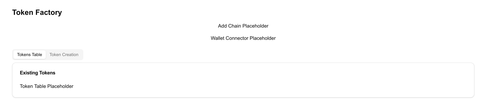
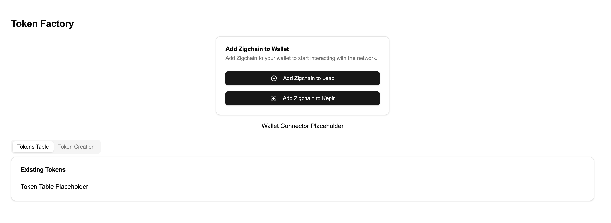
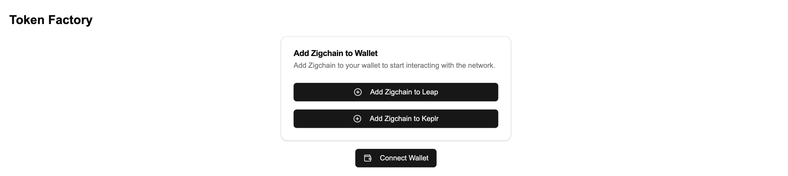
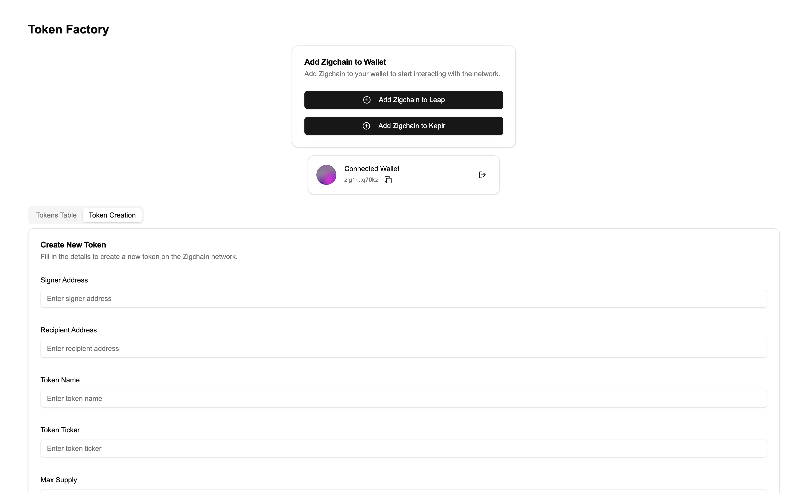

# Building a ZIGChain Token Factory Application

In this tutorial, we’ll create a **Token Factory** application using **React**, **Next.js**, **ZIGChain SDK**, and **Shadcn UI**. This app will allow users to:

1. Connect their wallet.
2. Add the ZIGChain network to their wallet.
3. View existing tokens on the ZIGChain network.
4. Create new tokens on the ZIGChain network.

We’ll build this application step by step, adding components incrementally to a main `TokenFactoryComponent`.

---

## Step 1: Set Up the Project

---

### 1.1 Initialize Shadcn UI

Set up Shadcn UI by running:

```bash
npx shadcn@latest init
```

Follow the prompts and select the default options.

### 1.2 Install Required Dependencies

We’ll need the following libraries for this project:

- **ZIGChain SDK**: To interact with the ZIGChain blockchain.
- **Cosmos Kit**: To manage wallets and chains.
- **Shadcn UI**: For pre-built, accessible UI components.
- **React Hook Form**: For form handling.
- **Zod**: For schema validation.
- **Radix React Icons**: Icons for the UI.

Install them by running:

```bash
yarn add cosmos-kit @cosmos-kit/react @cosmos-kit/keplr chain-registry @chain-registry/types @interchain-ui/react @hookform/resolvers react-hook-form zod @radix-ui/react-icons

```

---

### 1.3 Add Shadcn UI Components

We’ll use Shadcn UI components like buttons, cards, forms, and tabs. Install the required components:

```bash
npx shadcn@latest add button card form input checkbox toast alert skeleton table tabs tooltip
```

---

### 1.4 Create the Initial TokenFactoryComponent

Let’s create a basic `TokenFactoryComponent` to serve as the container for all the features we’ll add in the next steps.

1. Create a new file at `components/token-factory.tsx`.
2. Add the following code:

```typescript jsx
"use client";
import { Card, CardContent, CardHeader, CardTitle } from "@/components/ui/card";
import { Tabs, TabsContent, TabsList, TabsTrigger } from "@/components/ui/tabs";

export function TokenFactoryComponent() {
  return (
    <div className="container mx-auto p-4">
      <h1 className="text-2xl font-bold mb-4">Token Factory</h1>

      <div className="flex flex-col gap-4 mb-6 justify-center items-center">
        <p>Add Chain Placeholder</p>
        <p>Wallet Connector Placeholder</p>
      </div>

      <Tabs defaultValue="table" className="">
        <TabsList>
          <TabsTrigger value="table">Tokens Table</TabsTrigger>
          <TabsTrigger value="form">Token Creation</TabsTrigger>
        </TabsList>
        <TabsContent value="table">
          <Card>
            <CardHeader>
              <CardTitle>Existing Tokens</CardTitle>
            </CardHeader>
            <CardContent>
              <p>Token Table Placeholder</p>
            </CardContent>
          </Card>
        </TabsContent>
        <TabsContent value="form">
          <p>Token Creation Form Placeholder</p>
        </TabsContent>
      </Tabs>
    </div>
  );
}
```

---

### 1.5 Integrate TokenFactoryComponent into the Home Page

Now, integrate the `TokenFactoryComponent` into the main page of the app.

1. Open `app/page.tsx`.
2. Replace the content with:

```typescript jsx
"use client";

import { TokenFactoryComponent } from "@/components/token-factory";

export default function Home() {
  return (
    <div className="min-h-screen flex items-center justify-center p-8">
      <TokenFactoryComponent />
    </div>
  );
}
```

---

### 1.6 Run the Application

Start the development server:

```bash
npm run dev
```

Open [http://localhost:3000](http://localhost:3000). You should see:

- A **Token Factory** title.
- A placeholder layout for the components we’ll build in the next steps.

---

### Recap of Step 1:

- Set up a **Next.js** project using Shadcn UI.
- Installed the necessary dependencies, including ZIGChain SDK.
- Created the `TokenFactoryComponent` as the container for our application.
- Integrated it into the home page.

:::note[Current state]



:::

---

## Step 2: Set Up Layout and Providers

In this step, we’ll create the layout and provider components that define the global structure of our application. The **layout** ensures a consistent app structure, while the **providers** handle the connection to the ZIGChain network and manage global state.

---

### 2.1 Create the Providers Component

The **Providers** component manages global configurations for interacting with the ZIGChain network. It:

- Configures wallet connection options.
- Sets up endpoints for ZIGChain testnet, mainnet, or localnet.
- Wraps the app with `ChainProvider` to enable ZIGChain-specific utilities.

#### Steps:

1. Create a new file at `src/lib/Providers.tsx`.
2. Add the following code:

```typescript jsx
"use client";

import * as React from "react";
import {
  localzigchainAssetlist,
  testnetConfig,
  zigchain,
  ZigchainContextProvider,
} from "@zigchain/zigchain-sdk";

export function Providers({ children }: { children: React.ReactNode }) {
  return (
    <ZigchainContextProvider network="testnet">
      {children}
    </ZigchainContextProvider>
  );
}
```

### 2.2 Update the Layout Component

The layout component defines the main structure of our app. It includes elements like:

- A **global state provider** to manage ZIGChain configurations.
- A **notification system** to display alerts and feedback.

#### Steps:

1. Open the file at `app/layout.tsx`.
2. Add the following code:

```typescript jsx
import { Toaster } from "@/components/ui/toaster";
import { Providers } from "@/lib/Providers";
import { Metadata } from "next";
import "./globals.css";

export const metadata: Metadata = {
  title: "ZIGChain Token Factory",
  description: "Create and manage tokens on the ZIGChain network",
};

export default function RootLayout({
  children,
}: {
  children: React.ReactNode;
}) {
  return (
    <html lang="en">
      <body>
        <Providers>{children}</Providers>
        <Toaster />
      </body>
    </html>
  );
}
```

#### Explanation:

- **Metadata**:
  - Defines the page title and description. Used for SEO and browser tab information.
- **Providers**:
  - Wraps the app and manages state like wallet connections and network configurations.
- **Toaster**:
  - Displays notifications (e.g., success/error messages) using Shadcn UI’s toast component.

This layout ensures that every page in the app has consistent structure and functionality.

---

#### Explanation:

- **ChainProvider**:
  - Configures the app to interact with the ZIGChain network.
  - Provides wallet connection options and defines RPC and REST endpoints for ZIGChain.
- **Wallet Options**:
  - Allows connection to popular wallets like Leap and Keplr using `wallets`.
- **Signer Options**:
  - Specifies the signing type for transactions (`direct` for Protobuf-based transactions).
- **ZigchainContextProvider**:
  - Wraps the app to enable ZIGChain-specific utilities and hooks throughout the application.

This component is essential for managing wallet connections and interacting with the ZIGChain blockchain.

---

### Recap of Step 2:

- Created a **layout component** to manage the app’s structure and global utilities.
- Added a **providers component** to handle wallet connections, ZIGChain configurations, and state management.

---

## Step 3: Add the AddChainComponent

In this step, we’ll create the **AddChainComponent** and integrate it into the `TokenFactoryComponent`. This component will allow users to add ZIGChain to their wallet if it hasn’t been added yet.

---

### 3.1 Create the AddChainComponent

1. Create a new file at `components/add-chain-component.tsx`.
2. Add the following code:

```typescript jsx
"use client";

import { Alert, AlertDescription, AlertTitle } from "@/components/ui/alert";
import { Button } from "@/components/ui/button";
import {
  Card,
  CardContent,
  CardDescription,
  CardFooter,
  CardHeader,
  CardTitle,
} from "@/components/ui/card";
import { ExclamationTriangleIcon } from "@radix-ui/react-icons";
import { ExternalLink, PlusCircle } from "lucide-react";
import { useAddChain } from "@zigchain/zigchain-sdk";

const AddChainComponent = () => {
  const { addChain, isLoading, error, installUrl } = useAddChain();

  const handleAddChain = async (wallet: "leap" | "keplr") => {
    await addChain(wallet, "testnet"); // Replace "testnet" with "mainnet" or "localnet" as needed
  };

  return (
    <Card className="w-full max-w-md">
      <CardHeader>
        <CardTitle>Add ZIGChain to Wallet</CardTitle>
        <CardDescription>
          Add ZIGChain to your wallet to start interacting with the network.
        </CardDescription>
      </CardHeader>
      <CardContent className="space-y-4">
        {installUrl ? (
          <Alert>
            <ExclamationTriangleIcon className="h-4 w-4" />
            <AlertTitle>Wallet not found</AlertTitle>
            <AlertDescription>
              You need to install a compatible wallet first.
              <Button variant="link" className="p-0 h-auto font-normal" asChild>
                <a href={installUrl} target="_blank" rel="noopener noreferrer">
                  Install Wallet <ExternalLink className="h-4 w-4 ml-1" />
                </a>
              </Button>
            </AlertDescription>
          </Alert>
        ) : (
          <>
            <Button
              onClick={() => handleAddChain("leap")}
              disabled={isLoading}
              className="w-full"
            >
              <PlusCircle className="mr-2 h-4 w-4" />
              {isLoading ? "Adding..." : "Add ZIGChain to Leap"}
            </Button>
            <Button
              onClick={() => handleAddChain("keplr")}
              disabled={isLoading}
              className="w-full"
            >
              <PlusCircle className="mr-2 h-4 w-4" />
              {isLoading ? "Adding..." : "Add ZIGChain to Keplr"}
            </Button>
          </>
        )}
      </CardContent>
      {error && (
        <CardFooter>
          <Alert variant="destructive">
            <ExclamationTriangleIcon className="h-4 w-4" />
            <AlertTitle>Error</AlertTitle>
            <AlertDescription>{error.message}</AlertDescription>
          </Alert>
        </CardFooter>
      )}
    </Card>
  );
};

export default AddChainComponent;
```

---

### 3.2 Integrate AddChainComponent into TokenFactoryComponent

Now, integrate the **AddChainComponent** into the `TokenFactoryComponent`.

1. Open `components/token-factory.tsx`.
2. Replace the **"Add Chain Placeholder"** with the actual component.

Here’s the updated code:

```typescript jsx
"use client";

import { Card, CardContent, CardHeader, CardTitle } from "@/components/ui/card";
import { Tabs, TabsContent, TabsList, TabsTrigger } from "@/components/ui/tabs";
import AddChainComponent from "./add-chain-component";

export function TokenFactoryComponent() {
  return (
    <div className="container mx-auto p-4">
      <h1 className="text-2xl font-bold mb-4">Token Factory</h1>

      <div className="flex flex-col gap-4 mb-6 justify-center items-center">
        <AddChainComponent />
        <p>Wallet Connector Placeholder</p>
      </div>

      <Tabs defaultValue="table" className="">
        <TabsList>
          <TabsTrigger value="table">Tokens Table</TabsTrigger>
          <TabsTrigger value="form">Token Creation</TabsTrigger>
        </TabsList>
        <TabsContent value="table">
          <Card>
            <CardHeader>
              <CardTitle>Existing Tokens</CardTitle>
            </CardHeader>
            <CardContent>
              <p>Token Table Placeholder</p>
            </CardContent>
          </Card>
        </TabsContent>
        <TabsContent value="form">
          <p>Token Creation Form Placeholder</p>
        </TabsContent>
      </Tabs>
    </div>
  );
}
```

---

### 3.3 Run the Application

Start the development server to verify the changes:

```bash
npm run dev
```

Visit [http://localhost:3000](http://localhost:3000). You should now see the **Add ZIGChain to Wallet** component instead of the placeholder.

---

### Recap of Step 3:

- Created the **AddChainComponent** to help users add ZIGChain to their wallets.
- Integrated it into the `TokenFactoryComponent`.

:::note[Current state]



:::

---

## Step 4: Add the WalletConnector Component

In this step, we’ll create the **WalletConnector** component to enable users to connect or disconnect their wallets. Then, we’ll replace the **"Wallet Connector Placeholder"** in the `TokenFactoryComponent` with this new component.

---

### 4.1 Create the WalletConnector Component

1. Create a new file at `components/wallet-connector.tsx`.
2. Add the following code:

```typescript jsx
"use client";

import { Button } from "@/components/ui/button";
import { Card, CardContent } from "@/components/ui/card";
import {
  Tooltip,
  TooltipContent,
  TooltipProvider,
  TooltipTrigger,
} from "@/components/ui/tooltip";
import "@interchain-ui/react/styles"; // Imports styles for the wallet connect modal
import { CopyIcon } from "@radix-ui/react-icons";
import { LogOut, Wallet } from "lucide-react";
import { shortenAddress, ZigchainAddressAvatar } from "@zigchain/zigchain-sdk";

interface WalletConnectorProps {
  onConnect: () => void;
  onDisconnect: () => void;
  address: string | undefined;
}

export function WalletConnector({
  onConnect,
  onDisconnect,
  address,
}: WalletConnectorProps) {
  const handleCopyAddress = () => {
    if (address) {
      navigator.clipboard.writeText(address);
    }
  };

  if (!address) {
    return (
      <Button onClick={onConnect} className="w-full sm:w-auto">
        <Wallet className="mr-2 h-4 w-4" />
        Connect Wallet
      </Button>
    );
  }

  return (
    <TooltipProvider>
      <Card className="w-full max-w-sm">
        <CardContent className="flex items-center justify-between p-4">
          <div className="flex items-center space-x-4">
            <ZigchainAddressAvatar className="h-10 w-10" address={address} />
            <div>
              <p className="text-sm font-medium">Connected Wallet</p>
              <div className="flex items-center space-x-2">
                <Tooltip>
                  <TooltipTrigger asChild>
                    <p className="text-xs text-muted-foreground cursor-pointer">
                      {shortenAddress(address)}
                    </p>
                  </TooltipTrigger>
                  <TooltipContent>
                    <p>{address}</p>
                  </TooltipContent>
                </Tooltip>
                <Tooltip>
                  <TooltipTrigger asChild>
                    <Button
                      variant="ghost"
                      size="icon"
                      className="h-6 w-6"
                      onClick={handleCopyAddress}
                    >
                      <CopyIcon className="h-3 w-3" />
                      <span className="sr-only">Copy address</span>
                    </Button>
                  </TooltipTrigger>
                  <TooltipContent>
                    <p>Copy address</p>
                  </TooltipContent>
                </Tooltip>
              </div>
            </div>
          </div>
          <Tooltip>
            <TooltipTrigger asChild>
              <Button
                variant="ghost"
                size="icon"
                onClick={onDisconnect}
                aria-label="Disconnect wallet"
              >
                <LogOut className="h-4 w-4" />
              </Button>
            </TooltipTrigger>
            <TooltipContent>
              <p>Disconnect wallet</p>
            </TooltipContent>
          </Tooltip>
        </CardContent>
      </Card>
    </TooltipProvider>
  );
}
```

---

### 4.2 Integrate WalletConnector into TokenFactoryComponent

Now, integrate the **WalletConnector** into the `TokenFactoryComponent`.

1. Open `components/token-factory.tsx`.
2. Replace the **"Wallet Connector Placeholder"** with the **WalletConnector** component.

Here’s the updated code:

```typescript jsx
"use client";

import { Card, CardContent, CardHeader, CardTitle } from "@/components/ui/card";
import { Tabs, TabsContent, TabsList, TabsTrigger } from "@/components/ui/tabs";
import AddChainComponent from "./add-chain-component";
import { WalletConnector } from "./wallet-connector";
import { useChain } from "@cosmos-kit/react";

export function TokenFactoryComponent() {
  const { connect, disconnect, address } = useChain("zigchain");

  return (
    <div className="container mx-auto p-4">
      <h1 className="text-2xl font-bold mb-4">Token Factory</h1>

      <div className="flex flex-col gap-4 mb-6 justify-center items-center">
        {!address && <AddChainComponent />}
        <WalletConnector
          onConnect={() => connect()}
          onDisconnect={() => disconnect()}
          address={address}
        />
      </div>

      <Tabs defaultValue="table" className="">
        <TabsList>
          <TabsTrigger value="table">Tokens Table</TabsTrigger>
          <TabsTrigger value="form">Token Creation</TabsTrigger>
        </TabsList>
        <TabsContent value="table">
          <Card>
            <CardHeader>
              <CardTitle>Existing Tokens</CardTitle>
            </CardHeader>
            <CardContent>
              <p>Token Table Placeholder</p>
            </CardContent>
          </Card>
        </TabsContent>
        <TabsContent value="form">
          <p>Token Creation Form Placeholder</p>
        </TabsContent>
      </Tabs>
    </div>
  );
}
```

---

### 4.3 Run the Application

Start the development server to test the wallet connection functionality:

```bash
npm run dev
```

Visit [http://localhost:3000](http://localhost:3000). You should now see the **Wallet Connector** component in place of the placeholder. Try connecting and disconnecting your wallet to see it in action.

---

### Recap of Step 4:

- Created the **WalletConnector** component to manage wallet connections.
- Integrated it into the `TokenFactoryComponent`.

:::note[Current state]



:::

---

## Step 5: Add the TokenTableComponent

In this step, we’ll create the **TokenTableComponent** to display the tokens available on the ZIGChain network. Then, we’ll replace the **"Token Table Placeholder"** in the `TokenFactoryComponent` with this new component.

---

### 5.1 Create the TokenTableComponent

1. Create a new file at `components/token-table.tsx`.
2. Add the following code:

```typescript jsx
"use client";

import { Alert, AlertDescription, AlertTitle } from "@/components/ui/alert";
import {
  Table,
  TableBody,
  TableCell,
  TableHead,
  TableHeader,
  TableRow,
} from "@/components/ui/table";
import { Skeleton } from "@/components/ui/skeleton";
import { ExclamationTriangleIcon } from "@radix-ui/react-icons";
import Image from "next/image";
import { ExtendedDenom } from "@zigchain/zigchain-sdk";

interface TokenTableProps {
  data: ExtendedDenom[];
  error: Error | null;
  isLoading: boolean;
}

export function TokenTableComponent({
  data,
  error,
  isLoading,
}: TokenTableProps) {
  if (isLoading) return <LoadingState />;
  if (error) return <ErrorState message={error.message} />;
  if (!data || data.length === 0) return <EmptyState />;

  return (
    <Table>
      <TableHeader>
        <TableRow>
          <TableHead>Icon</TableHead>
          <TableHead>Name and Symbol</TableHead>
          <TableHead>Total Supply</TableHead>
          <TableHead>Base Denom</TableHead>
        </TableRow>
      </TableHeader>
      <TableBody>
        {data.map((token) => (
          <TableRow key={token.denom}>
            <TableCell>
              <Image
                unoptimized
                width={40}
                height={40}
                src={token.extraData.icon}
                alt={token.metadata.name}
                className="rounded-full"
              />
            </TableCell>
            <TableCell>
              <div>
                <p className="font-medium">{token.metadata.name}</p>
                <p className="text-sm text-muted-foreground">
                  {token.metadata.symbol}
                </p>
              </div>
            </TableCell>
            <TableCell>{token.maxSupply}</TableCell>
            <TableCell>{token.metadata.base}</TableCell>
          </TableRow>
        ))}
      </TableBody>
    </Table>
  );
}

function LoadingState() {
  return (
    <div className="space-y-4">
      <Skeleton className="h-4 w-full" />
      <Skeleton className="h-4 w-full" />
      <Skeleton className="h-4 w-full" />
    </div>
  );
}

function ErrorState({ message }: { message: string }) {
  return (
    <Alert variant="destructive">
      <ExclamationTriangleIcon className="h-4 w-4" />
      <AlertTitle>Error</AlertTitle>
      <AlertDescription>{message}</AlertDescription>
    </Alert>
  );
}

function EmptyState() {
  return (
    <Alert>
      <ExclamationTriangleIcon className="h-4 w-4" />
      <AlertTitle>No tokens found</AlertTitle>
      <AlertDescription>
        There are no tokens available to display at the moment.
      </AlertDescription>
    </Alert>
  );
}
```

---

### 5.2 Integrate TokenTableComponent into TokenFactoryComponent

1. Open `components/token-factory.tsx`.
2. Replace the **"Token Table Placeholder"** with the **TokenTableComponent**.

Here’s the updated code:

```typescript jsx
"use client";

import { Card, CardContent, CardHeader, CardTitle } from "@/components/ui/card";
import { Tabs, TabsContent, TabsList, TabsTrigger } from "@/components/ui/tabs";
import AddChainComponent from "./add-chain-component";
import { WalletConnector } from "./wallet-connector";
import { TokenTableComponent } from "./token-table";
import { useTokenTableData } from "@zigchain/zigchain-sdk";
import { useChain } from "@cosmos-kit/react";

export function TokenFactoryComponent() {
  const { connect, disconnect, address } = useChain("zigchain");
  const { data, error, isLoading } = useTokenTableData("1", "50");

  return (
    <div className="container mx-auto p-4">
      <h1 className="text-2xl font-bold mb-4">Token Factory</h1>

      <div className="flex flex-col gap-4 mb-6 justify-center items-center">
        <AddChainComponent />
        <WalletConnector
          onConnect={() => connect()}
          onDisconnect={() => disconnect()}
          address={address}
        />
      </div>

      <Tabs defaultValue="table" className="">
        <TabsList>
          <TabsTrigger value="table">Tokens Table</TabsTrigger>
          <TabsTrigger value="form">Token Creation</TabsTrigger>
        </TabsList>
        <TabsContent value="table">
          <Card>
            <CardHeader>
              <CardTitle>Existing Tokens</CardTitle>
            </CardHeader>
            <CardContent>
              <TokenTableComponent
                data={data}
                error={error}
                isLoading={isLoading}
              />
            </CardContent>
          </Card>
        </TabsContent>
        <TabsContent value="form">
          <p>Token Creation Form Placeholder</p>
        </TabsContent>
      </Tabs>
    </div>
  );
}
```

---

### 5.3 Run the Application

Start the development server to test the token table functionality:

```bash
npm run dev
```

Visit [http://localhost:3000](http://localhost:3000). You should now see the **Token Table** populated with data from the ZIGChain network (if available).

---

### Recap of Step 5:

- Created the **TokenTableComponent** to display tokens available on ZIGChain.
- Integrated it into the `TokenFactoryComponent`.

---

## Step 6: Add the TokenCreationFormComponent

In this step, we’ll create the **TokenCreationFormComponent** to allow users to create new tokens on the ZIGChain network. Then, we’ll replace the **"Token Creation Form Placeholder"** in the `TokenFactoryComponent` with this new component.

---

### 6.1 Create the TokenCreationFormComponent

1. Create a new file at `components/token-creation-form.tsx`.
2. Add the following code:

```typescript jsx
"use client";

import { Button } from "@/components/ui/button";
import {
  Card,
  CardContent,
  CardDescription,
  CardFooter,
  CardHeader,
  CardTitle,
} from "@/components/ui/card";
import { Checkbox } from "@/components/ui/checkbox";
import {
  Form,
  FormControl,
  FormDescription,
  FormField,
  FormItem,
  FormLabel,
  FormMessage,
} from "@/components/ui/form";
import { Input } from "@/components/ui/input";
import { toast } from "@/hooks/use-toast";
import { zodResolver } from "@hookform/resolvers/zod";
import { ReloadIcon } from "@radix-ui/react-icons";
import { useForm } from "react-hook-form";
import { useCreateToken } from "@zigchain/zigchain-sdk";
import * as z from "zod";

const formSchema = z.object({
  signer: z.string().min(1, "Signer address is required"),
  recipient: z.string().min(1, "Recipient address is required"),
  name: z.string().min(1, "Token name is required"),
  ticker: z.string().min(1, "Token ticker is required"),
  maxSupply: z.number().int().positive(),
  fixedSupply: z.boolean(),
  metadataUri: z.string().url("Invalid URL"),
  uriHash: z.string().min(1, "URI hash is required"),
});

interface TokenCreationFormProps {
  onSuccess?: () => void;
}

export function TokenCreationFormComponent({
  onSuccess,
}: TokenCreationFormProps) {
  const { createToken, isLoading, error } = useCreateToken();

  const form = useForm<z.infer<typeof formSchema>>({
    resolver: zodResolver(formSchema),
    defaultValues: {
      signer: "",
      recipient: "",
      name: "",
      ticker: "",
      maxSupply: 1000,
      fixedSupply: true,
      metadataUri:
        "https://plum-accepted-dolphin-229.mypinata.cloud/ipfs/Qme71eMxJMBm9VVSxvRkt7ytXr1yAzat1QqBsULsURg6oi",
      uriHash: "exampleUriHash",
    },
  });

  const onSubmit = async (values: z.infer<typeof formSchema>) => {
    try {
      await createToken({
        ...values,
        onSuccess: () => {
          toast({
            title: "Token Created",
            description: "Your token has been created successfully!",
          });
          form.reset();
          onSuccess?.();
        },
      });
    } catch (err) {
      toast({
        title: "Error",
        description: error?.message || `An unknown error occurred: ${err}`,
        variant: "destructive",
      });
    }
  };

  return (
    <Card className="w-full">
      <CardHeader>
        <CardTitle>Create New Token</CardTitle>
        <CardDescription>
          Fill in the details to create a new token on the ZIGChain network.
        </CardDescription>
      </CardHeader>
      <CardContent>
        <Form {...form}>
          <form onSubmit={form.handleSubmit(onSubmit)} className="space-y-8">
            <FormField
              control={form.control}
              name="signer"
              render={({ field }) => (
                <FormItem>
                  <FormLabel>Signer Address</FormLabel>
                  <FormControl>
                    <Input placeholder="Enter signer address" {...field} />
                  </FormControl>
                  <FormMessage />
                </FormItem>
              )}
            />
            <FormField
              control={form.control}
              name="recipient"
              render={({ field }) => (
                <FormItem>
                  <FormLabel>Recipient Address</FormLabel>
                  <FormControl>
                    <Input placeholder="Enter recipient address" {...field} />
                  </FormControl>
                  <FormMessage />
                </FormItem>
              )}
            />
            <FormField
              control={form.control}
              name="name"
              render={({ field }) => (
                <FormItem>
                  <FormLabel>Token Name</FormLabel>
                  <FormControl>
                    <Input placeholder="Enter token name" {...field} />
                  </FormControl>
                  <FormMessage />
                </FormItem>
              )}
            />
            <FormField
              control={form.control}
              name="ticker"
              render={({ field }) => (
                <FormItem>
                  <FormLabel>Token Ticker</FormLabel>
                  <FormControl>
                    <Input placeholder="Enter token ticker" {...field} />
                  </FormControl>
                  <FormMessage />
                </FormItem>
              )}
            />
            <FormField
              control={form.control}
              name="maxSupply"
              render={({ field }) => (
                <FormItem>
                  <FormLabel>Max Supply</FormLabel>
                  <FormControl>
                    <Input
                      type="number"
                      {...field}
                      onChange={(e) =>
                        field.onChange(parseInt(e.target.value, 10))
                      }
                    />
                  </FormControl>
                  <FormMessage />
                </FormItem>
              )}
            />
            <FormField
              control={form.control}
              name="fixedSupply"
              render={({ field }) => (
                <FormItem className="flex flex-row items-start space-x-3 space-y-0 rounded-md border p-4">
                  <FormControl>
                    <Checkbox
                      checked={field.value}
                      onCheckedChange={field.onChange}
                    />
                  </FormControl>
                  <div className="space-y-1 leading-none">
                    <FormLabel>Fixed Supply</FormLabel>
                    <FormDescription>
                      If checked, the token supply cannot be changed after
                      creation.
                    </FormDescription>
                  </div>
                </FormItem>
              )}
            />
            <FormField
              control={form.control}
              name="metadataUri"
              render={({ field }) => (
                <FormItem>
                  <FormLabel>Metadata URI</FormLabel>
                  <FormControl>
                    <Input placeholder="Enter metadata URI" {...field} />
                  </FormControl>
                  <FormMessage />
                </FormItem>
              )}
            />
            <FormField
              control={form.control}
              name="uriHash"
              render={({ field }) => (
                <FormItem>
                  <FormLabel>URI Hash</FormLabel>
                  <FormControl>
                    <Input placeholder="Enter URI hash" {...field} />
                  </FormControl>
                  <FormMessage />
                </FormItem>
              )}
            />
          </form>
        </Form>
      </CardContent>
      <CardFooter>
        <Button
          onClick={form.handleSubmit(onSubmit)}
          disabled={isLoading}
          className="w-full"
        >
          {isLoading ? (
            <>
              <ReloadIcon className="mr-2 h-4 w-4 animate-spin" />
              Creating...
            </>
          ) : (
            "Create Token"
          )}
        </Button>
      </CardFooter>
    </Card>
  );
}
```

---

### 6.2 Integrate TokenCreationFormComponent into TokenFactoryComponent

1. Open `components/token-factory.tsx`.
2. Replace the **"Token Creation Form Placeholder"** with the **TokenCreationFormComponent**.

Here’s the updated code:

```typescript jsx
"use client";

import { Card, CardContent, CardHeader, CardTitle } from "@/components/ui/card";
import { Tabs, TabsContent, TabsList, TabsTrigger } from "@/components/ui/tabs";
import AddChainComponent from "./add-chain-component";
import { WalletConnector } from "./wallet-connector";
import { TokenTableComponent } from "./token-table";
import { TokenCreationFormComponent } from "./token-creation-form";
import { useTokenTableData } from "@zigchain/zigchain-sdk";
import { useChain } from "@cosmos-kit/react";

export function TokenFactoryComponent() {
  const { connect, disconnect, address } = useChain("zigchain");
  const { data, error, isLoading, mutate } = useTokenTableData("1", "50");

  return (
    <div className="container mx-auto p-4">
      <h1 className="text-2xl font-bold mb-4">Token Factory</h1>

      <div className="flex flex-col gap-4 mb-6 justify-center items-center">
        <AddChainComponent />
        <WalletConnector
          onConnect={() => connect()}
          onDisconnect={() => disconnect()}
          address={address}
        />
      </div>

      <Tabs defaultValue="table" className="">
        <TabsList>
          <TabsTrigger value="table">Tokens Table</TabsTrigger>
          <TabsTrigger value="form">Token Creation</TabsTrigger>
        </TabsList>
        <TabsContent value="table">
          <Card>
            <CardHeader>
              <CardTitle>Existing Tokens</CardTitle>
            </CardHeader>
            <CardContent>
              <TokenTableComponent
                data={data}
                error={error}
                isLoading={isLoading}
              />
            </CardContent>
          </Card>
        </TabsContent>
        <TabsContent value="form">
          <TokenCreationFormComponent onSuccess={() => mutate()} />
        </TabsContent>
      </Tabs>
    </div>
  );
}
```

---

### 6.3 Run the Application

Start the development server to test the token creation functionality:

```bash
npm run dev
```

Visit [http://localhost:3000](http://localhost:3000). You should now see the **Token Creation Form** under the **Token Creation** tab.

---

### Recap of Step 6:

- Created the **TokenCreationFormComponent** to allow users to create tokens.
- Integrated it into the `TokenFactoryComponent`.

:::note[Final state]



:::

---

You now have a fully functioning Token Factory app that allows users to:

- Add ZIGChain to their wallet.
- Connect and disconnect their wallet.
- View tokens in a table.
- Create new tokens on ZIGChain.
