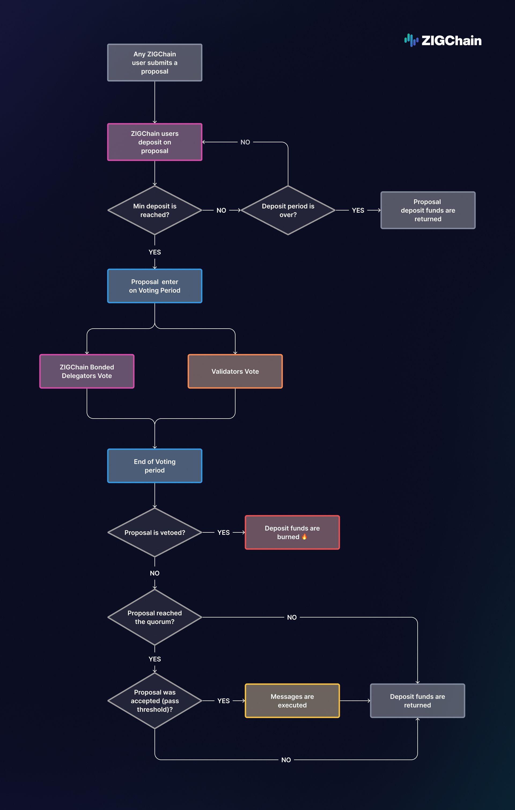

import Tabs from '@theme/Tabs';
import TabItem from '@theme/TabItem';

# Governance

ZIGChain Governance is a **decentralized decision-making process** that allows ZIGChain users to **participate in the network's future**. Users can vote on proposals, where each ZIG token equals one vote, to change parameters such as fees and validator count, or decide how to spend the treasury.

The Governance process is essential for ZIGChain's decentralized nature as it ensures the network evolves through Community consensus.

If you want to know more about the governance module, please read this article and then check the [ZIGChain - Governance Module](http://governance_builders.md/) documentation.

<div class="spacer"></div>

## Governance Process Overview

The ZIGChain governance process follows five key stages:

- 1️⃣ **Community Consultation**: Share your idea with the Community to gather feedback.

- 2️⃣ **Proposal Submission**: Submit your formal proposal to the network with an initial deposit. Any ZIG holder can submit proposals.

- 3️⃣ **Deposit Period**: During the deposit period, users can deposit ZIG to support the proposal and reach the minimum Deposit Amount. If the proposal reaches the minimum, it starts the Voting Period. If it doesn't, it is closed, and the deposited tokens are transferred back to the proposer and supporters.

- 4️⃣ **Voting Period**: During the voting period, ZIGChain Delegators with bonded tokens (with ZIG on active validators) can vote on the proposal. The proposal needs to reach the quorum and the threshold to be valid.

- 5️⃣ **Voting Results**: Once the voting period ends, the proposal is closed, and the final results are calculated.
  - If the proposal passes, it is executed and the deposited tokens are returned to the proposer and those who deposited the proposal.
  - If it is rejected, the deposited tokens are returned to the proposer and those who deposited the proposal.
  - If the proposal is vetoed, the deposited tokens are burned.

<div class="spacer"></div>



<div class="spacer"></div>

## Detailed Steps of the Governance Process

### 1️⃣ Share with the Community

While it is not mandatory, it is recommended that you share your idea with the Community before submitting a proposal. This way, you can gather feedback, improve your proposal, and gain supporters before submitting it to the network.

Use our forum to share your ideas with the Community.

---

### 2️⃣ Draft and Submit a Proposal

Submitting a proposal requires an initial deposit of at least 400 ZIG on Mainnet.

> ⚠️ _These values may change via governance proposals. Always confirm using the CLI or API._ (`minimum_initial_deposit_ratio * min_deposit = 0.04 * 10,000`).

- **Minimum Initial Deposit Ratio Example:**  
  Alice submits a proposal and deposits 200 ZIG to support it. However, as it doesn't reach the minimum, it is not valid (`0.04 * 10,000 = 400 ZIG`), so Alice should deposit at least 400 ZIG to submit the proposal.

---

### 3️⃣ Deposit Period

To prevent spam, proposals must reach a minimum deposit of 10,000 ZIG before proceeding to the voting period. During the deposit period, ZIG holders can deposit any amount of ZIG to support the proposal. Once the total deposits reach 10,000 ZIG, the voting period begins. If the minimum deposit is not met by the end of the period, the proposal is closed, and all deposited ZIG are returned.

- **Deposit Period and Amounts Example:**  
  Alice submitted a proposal with a deposit of 8,000 ZIG. After 4 days, the proposal has yet to reach the minimum deposit amount (10,000), so the 8,000 ZIG are returned to Alice.

---

### 4️⃣ Voting Period

Once the deposit threshold is met, the proposal enters a voting phase lasting 4 days, or 1 day if expedited. ZIGChain delegators with bonded tokens (i.e., tokens staked with active validators, to learn more about how to stake your coins check [How Staking Works on ZIGChain](./staking#how-staking-works-on-zigchain)) can cast vote as follows:

- **Yes**
- **No**
- **No with Veto** (to reject malicious proposals)
- **Abstain**

Votes cast by validators are automatically inherited by their delegators unless the delegators cast their own vote. If a delegator has both bonded and unbonded tokens, only the bonded tokens are considered in the vote count.

- **Voting Example:**  
  Alice has 10,000 ZIG delegated to 2 validators. Validator A has 6,000 ZIG (active) and Validator B has 4,000 ZIG (inactive). If Alice votes, only the 6,000 ZIG staked with Validator A are considered. If she doesn’t vote, her vote defaults to Validator A's choice.

---

### 5️⃣ Voting Results

A proposal must meet three conditions to pass:

1. **Veto Check:**  
   "No with Veto" votes must not exceed 33.4% of total votes; otherwise, the proposal is vetoed, and deposits are burned.

2. **Quorum Check:**  
   At least 33.4% of total bonded ZIGs must participate in the vote.

3. **Threshold Check:**  
   At least 51% of non-abstaining votes must be in favor.

Proposals are rejected if quorum or threshold are not met.

- **Quorum Example:**  
  Alice and Bob's proposal reaches the minimum deposit. With 1 million bonded ZIG in the network, 334,000 ZIG (33.4%) voting participation is needed to meet quorum. The proposal receives only 250,000 ZIG in voting participation during the voting period (less than the quorum), resulting in a return of deposits to Alice and Bob.

- **Veto Example:**  
  Alice proposes a malicious proposal. During the voting period, the proposal has the following votes:  
  Yes - 100,000  
  No - 50,000  
  Abstain - 100,000  
  No with Veto - 150,000

  The proposal is vetoed as the number of "No with Veto" votes is greater than `total votes * veto threshold` (`150,000 > 400,000 * 33.4% = 133,333.33333`). As it is tagged as a vetoed proposal, the deposited ZIG are burned.

- **Threshold Example:**  
  Alice submitted a proposal and deposited 25,000 ZIG to support it. The proposal has the following votes:  
  Yes - 105,000  
  No - 50,000  
  Abstentions - 195,000  
  No with Veto - 50,000

  The proposal reaches the quorum and is not vetoed. It is accepted if the number of yes votes exceeds the threshold calculation:  
  `Yes > 51% * (total votes - abstentions)`  
  `(105,000 > 0.51 * (400,000 - 195,000)) -> (105,000 > 104,550)`  
  The proposal is accepted.

<div class="spacer"></div>

## Special Cases in Governance

### Expedited Proposals

Urgent matters can be submitted through an expedited proposal with a 1-day voting period and a higher threshold of 66.67% Yes votes (compared to 51% standard).

- **Expedite Example:**  
  Alice proposes an expedited proposal with a deposit of 500,000 ZIG. After meeting the minimum deposit requirement, the proposal enters a 1-day voting period where it must achieve both quorum and the 66.67% approval threshold to pass.

<div class="spacer"></div>

### Cancel Proposals

Proposals can be canceled before the voting period ends. Upon cancellation, 50% of the total deposit is refunded to the proposer and supporters, while the remaining 50% is burned.

- **Cancel Proposal Example:**  
  Alice deposits 20,000 ZIG and Bob adds 5,000 ZIG to support the proposal. If Alice cancels the proposal, half of the total deposit (12,500 ZIG) is burned and half is returned proportionally:
  - Alice receives 10,000 ZIG
  - Bob receives 2,500 ZIG

<div class="spacer"></div>

## Governance Proposal Statuses

These values are emitted in transaction logs under the `proposal_result` attribute and describe the final outcome of the proposal.

| **Status**                     | **Description**                                            |
| ------------------------------ | ---------------------------------------------------------- |
| `proposal_dropped`             | Proposal didn't meet the minimum deposit.                  |
| `proposal_passed`              | Proposal passed quorum and threshold successfully.         |
| `proposal_rejected`            | Proposal failed quorum or vote threshold.                  |
| `expedited_proposal_rejected`  | Expedited proposal failed stricter voting rules.           |
| `optimistic_proposal_rejected` | Optimistic proposal failed its criteria.                   |
| `proposal_failed`              | Proposal passed voting but failed during execution.        |
| `proposal_canceled`            | Proposal was canceled by its proposer before voting ended. |

Users can check the current status of a proposal using CLI commands like:

<Tabs>
<TabItem value="Testnet" label="Testnet" default>

```bash
PROPOSAL_ID=1
zigchaind query gov proposal $PROPOSAL_ID \
--chain-id zig-test-2 --node https://public-zigchain-testnet-rpc.numia.xyz
```

</TabItem>
<TabItem value="Local" label="Local">

```bash
PROPOSAL_ID=1
zigchaind query gov proposal $PROPOSAL_ID \
--chain-id zigchain-1 --node http://localhost:26657
```

</TabItem>
</Tabs>

<div class="spacer"></div>

## Managing Governance Through ZIGChain Hub

Visit [ZIGChain Hub - Proposals](https://hub.zigchain.com/proposals/) to view and vote on governance proposals.

### Viewing Proposals

The proposals page displays:

- **Summary cards**: Total, Voting, Passed, and Rejected proposal counts
- **Proposals table**: ID, title, end time, and status for each proposal
- **Search**: Find specific proposals by title
- **Filter**: Filter by All or Active proposals
- **Proposal details**: Click any proposal to view full description, voting results

### How to Vote

1. **Connect your wallet** (Keplr or Leap) to ZIGChain Hub
2. **Navigate to active proposals** in the voting period
3. **Select your vote**: Yes, No, No with Veto, or Abstain
4. **Confirm the transaction**
5. **Monitor results** as the proposal progresses

**Note**: You need staked ZIG tokens to vote. Your voting power equals your staked amount, and if you don't vote, your vote will follow your validator’s choice.

<div class="spacer"></div>

## Governance Parameters

To ensure effective governance and discourage low-quality or spam proposals, ZIGChain has several parameters in place that regulate proposal deposits and determine what happens in various scenarios.
Refer to the [ZIGChain - Governance Module](../build/governance-module.md) for detailed parameter values.

## References

- [ZIGChain HUB - Proposals](https://hub.zigchain.com/proposals/)
- [Staking](./staking.md)
- [ZIGChain - Governance Module](../build/governance-module.md)
