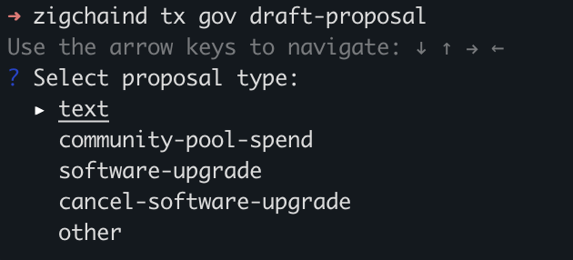
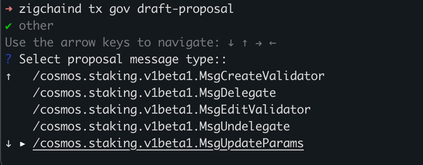
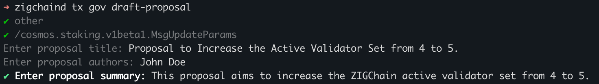
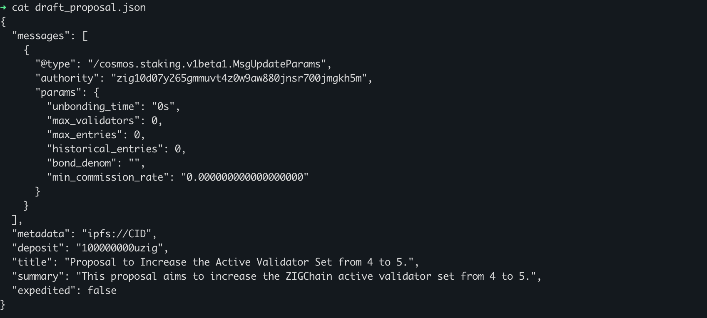
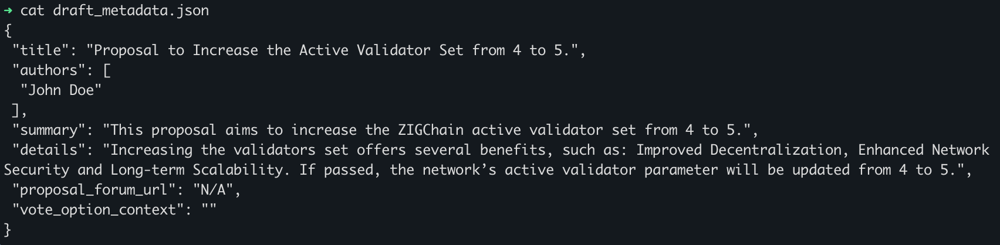
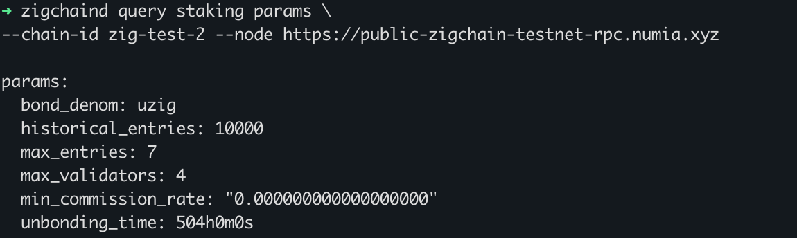
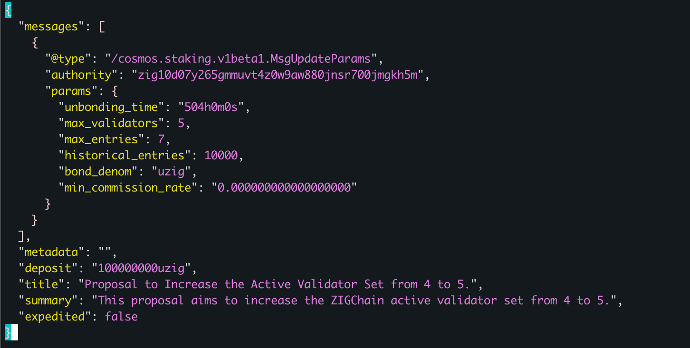
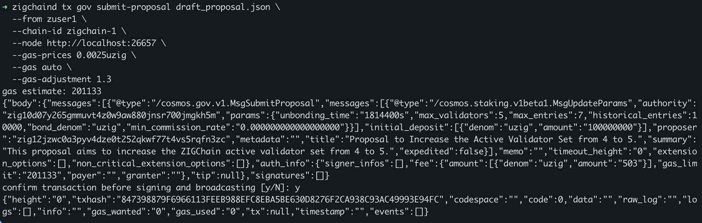
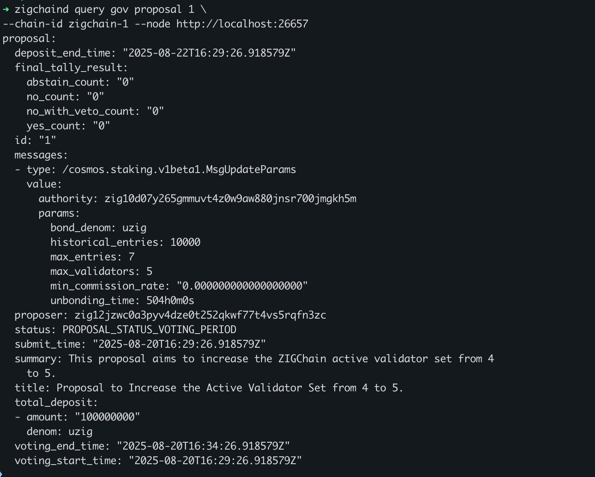

import Tabs from '@theme/Tabs';
import TabItem from '@theme/TabItem';

# ZIGChain Proposal Submission Guide

ZIGChain governance is the backbone of the network’s decentralized decision-making. Through governance, ZIG holders who
have staked their tokens with active validators can influence the future of the protocol —
from adjusting key parameters to deciding how community funds are allocated.

If you’re new to governance, we recommend first reading the [Governance](../governance)
documentation for better understanding of the proposal lifecycle and components, voting rules, and special cases.

Once you’re familiar with the concepts, this guide will help you take the next step: actually creating and submitting a
proposal on-chain.

In this guide, we focus on the practical side of governance — walking through each step from drafting a proposal to
submitting it on-chain. By the end, you’ll know how to transform an idea into a formal proposal ready for the community
to review and vote on.

<div class="spacer"></div>

## Detailed Steps for Submitting a Proposal

### 1️⃣ Draft a Proposal

To draft a proposal, follow these steps:

**1.1 Run the Draft Command**

Use the following command to start the proposal draft process:

```sh
zigchaind tx gov draft-proposal
```

---

**1.2 Select Proposal Type**

You’ll be prompted to select the type of proposal. The interface displays common options such as:

```
? Select proposal type:
  ▸ text
    community-pool-spend
    software-upgrade
    cancel-software-upgrade
    other
```

Output example:



If the type of proposal you need is not listed (for example, if you are modifying module parameters), select `other`.
This will display all supported message types accepted by the governance module, such as:

```
? Select proposal message type:
  ▸ /cosmos.auth.v1beta1.MsgUpdateParams
    /cosmos.bank.v1beta1.MsgSend
    /cosmos.distribution.v1beta1.MsgSetWithdrawAddress
```

Output example:



**Tip**: Use the arrow keys to navigate and **Enter** to select.

---

**1.3 Provide Metadata**  
After selecting, you'll be asked to fill in the required fields, such as:

- Title
- Summary
- Description
- Other fields (As requested by the interface.)

Output example:



---

**1.4 Review the Generated Files**

After completing the prompts, two files will be created:

- `draft_proposal.json`: Contains the actual message(s) to be executed if the proposal passes.
- `draft_metadata.json`: Contains a human-readable summary including title, description, summary.

Output examples:

    - `draft_proposal.json`



    - `draft_metadata.json`



<div class="spacer"></div>

### 2️⃣ Update Metadata Field

The `draft_proposal.json` must include a reference to the metadata. This link is not added automatically, so you need
to set it manually. There are several ways to do this:

- **Inline raw metadata** – insert the contents of `draft_metadata.json` directly into the `metadata` field.
- **Base64-encoded string** – encode the file contents in base64 and paste the result into the field.
- **IPFS reference** – upload the metadata file to IPFS and set the `metadata` field to the IPFS URI.

> ⚠️ The `metadata` field must be a JSON-encoded string and is limited to **255 characters**.

<div class="spacer"></div>

### 3️⃣ Configure Authority Field (If Required)

Certain proposal types, especially those altering module parameters, require an `authority` field.
This must match the address of the governance module account.

The default governance module account address is:

```
zig10d07y265gmmuvt4z0w9aw880jnsr700jmgkh5m
```

<div class="spacer"></div>

### 4️⃣ Making Updates Before Submission (If Necessary)

#### Updating Module Parameters

When proposing parameter changes, you must prepare the `draft_proposal.json` carefully.

> ⚠️ **Important:** Always include the full set of current parameters. Only change the values you intend to update, and
> leave all others exactly as they are.
> If you omit or leave parameters empty, they may be overwritten with empty values when the proposal is executed.

**1. Check Current Parameters**

Query the module to retrieve its current parameters before editing.

Example:

<Tabs>
  <TabItem value="Mainnet" label="Mainnet" default>

```sh
zigchaind query staking params \
--chain-id zigchain-1 --node https://public-zigchain-rpc.numia.xyz
```

  </TabItem>
  <TabItem value="Testnet" label="Testnet">

```sh
zigchaind query staking params \
--chain-id zig-test-2 --node https://public-zigchain-testnet-rpc.numia.xyz
```

  </TabItem>
  <TabItem value="Local" label="Local">

```sh
zigchaind query staking params \
--chain-id zigchain-1 --node http://localhost:26657
```

  </TabItem>
</Tabs>

Output example:



<br />

**2. Update the Proposal File**

Open `draft_proposal.json` and paste the full parameter set from the query output.

Modify **only** the values you want to change, ensuring all other parameters remain unchanged.

```sh
vim draft_proposal.json
```

Output example:



<div class="spacer"></div>

#### Expedited Proposals

To mark a proposal as expedited, set the expedited field to true:

```sh
jq '.expedited = true' draft_proposal.json > tmp.json && mv tmp.json draft_proposal.json
```

For more details, see the [Governance documentation](../governance#expedited-proposals)

<div class="spacer"></div>

### 5️⃣ Submit the Proposal

Once your proposal is ready, use the following command to submit it:

<Tabs>
  <TabItem value="Mainnet" label="Mainnet" default>

```sh
zigchaind tx gov submit-proposal draft_proposal.json \
  --from $ACCOUNT \
  --chain-id zigchain-1 \
  --node https://public-zigchain-rpc.numia.xyz \
  --gas-prices 0.0025uzig \
  --gas auto \
  --gas-adjustment 1.3
```

  </TabItem>
  <TabItem value="Testnet" label="Testnet">

```sh
zigchaind tx gov submit-proposal draft_proposal.json \
  --from $ACCOUNT \
  --chain-id zig-test-2 \
  --node https://public-zigchain-testnet-rpc.numia.xyz \
  --gas-prices 0.0025uzig \
  --gas auto \
  --gas-adjustment 1.3
```

  </TabItem>
  <TabItem value="Local" label="Local">

```sh
zigchaind tx gov submit-proposal draft_proposal.json \
  --from zuser1 \
  --chain-id zigchain-1 \
  --node http://localhost:26657 \
  --gas-prices 0.0025uzig \
  --gas auto \
  --gas-adjustment 1.3
```

  </TabItem>

</Tabs>

Output example:



If you see the error:

```
expected gov account as only signer for proposal message
```

It means that the `authority` in your proposal doesn't match the actual governance module account. Double-check the value and try again.

<div class="spacer"></div>

### 5️⃣ Confirm Proposal Creation

Once submitted, retrieve your proposal id:

<Tabs>
  <TabItem value="Mainnet" label="Mainnet" default>

```sh
zigchaind query gov proposals \
--chain-id zigchain-1 --node https://public-zigchain-rpc.numia.xyz
```

  </TabItem>
  <TabItem value="Testnet" label="Testnet">

```sh
zigchaind query gov proposals \
--chain-id zig-test-2 --node https://public-zigchain-testnet-rpc.numia.xyz
```

  </TabItem>
  <TabItem value="Local" label="Local">

```sh
zigchaind query gov proposals \
--chain-id zigchain-1 --node http://localhost:26657
```

  </TabItem>
</Tabs>

Or fetch a specific one:

<Tabs>
  <TabItem value="Mainnet" label="Mainnet" default>

```sh
zigchaind query gov proposal $PROPOSAL_ID \
--chain-id zigchain-1 --node https://public-zigchain-rpc.numia.xyz
```

  </TabItem>
  <TabItem value="Testnet" label="Testnet">

```sh
zigchaind query gov proposal $PROPOSAL_ID \
--chain-id zig-test-2 --node https://public-zigchain-testnet-rpc.numia.xyz
```

  </TabItem>
  <TabItem value="Local" label="Local">

```sh
zigchaind query gov proposal $PROPOSAL_ID \
--chain-id zigchain-1 --node http://localhost:26657
```

  </TabItem>
</Tabs>

This confirms your proposal was registered on-chain.

Output example:



<div class="spacer"></div>

## References

- [Governance](../governance)
- [Governance CLI Quick Sheet](../../build/governance-module#governance-cli-quick-sheet)
- [Cosmos SDK Governance Module](https://docs.cosmos.network/main/build/modules/gov)
