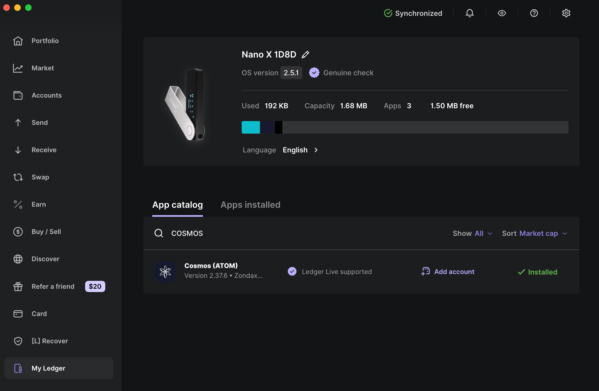
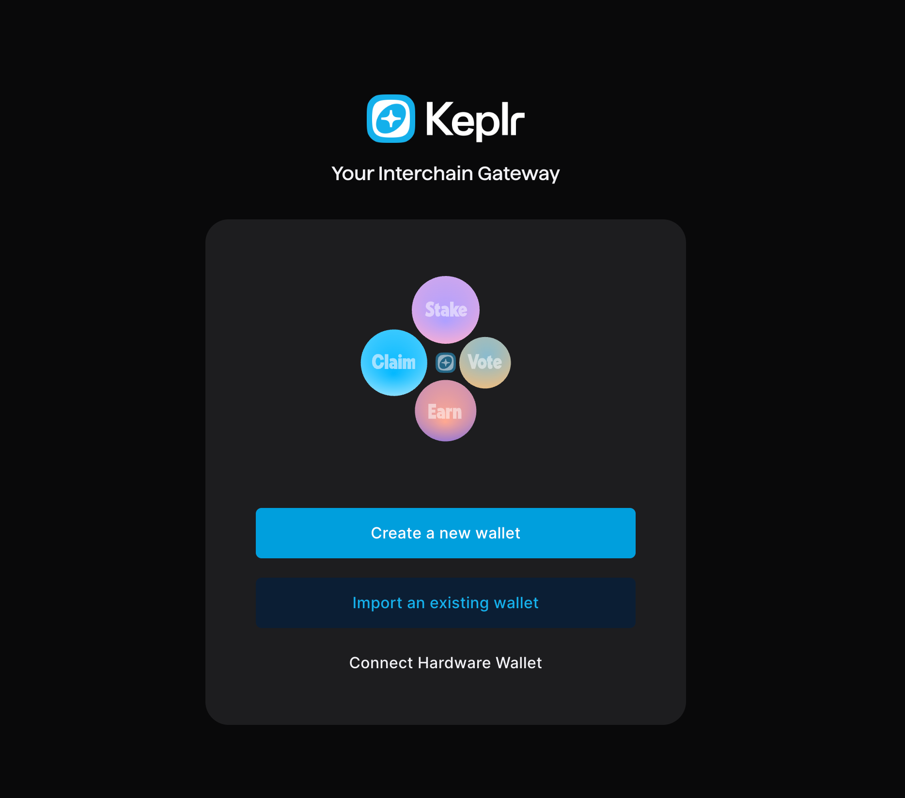
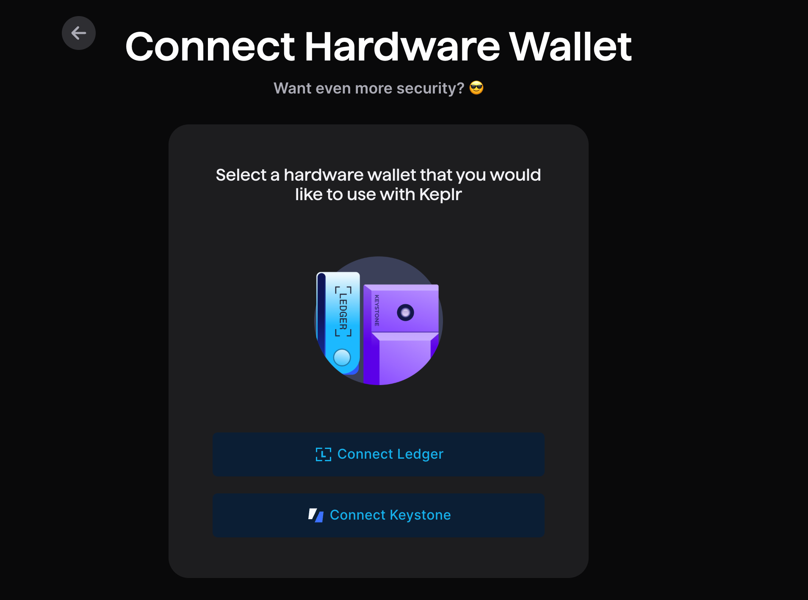
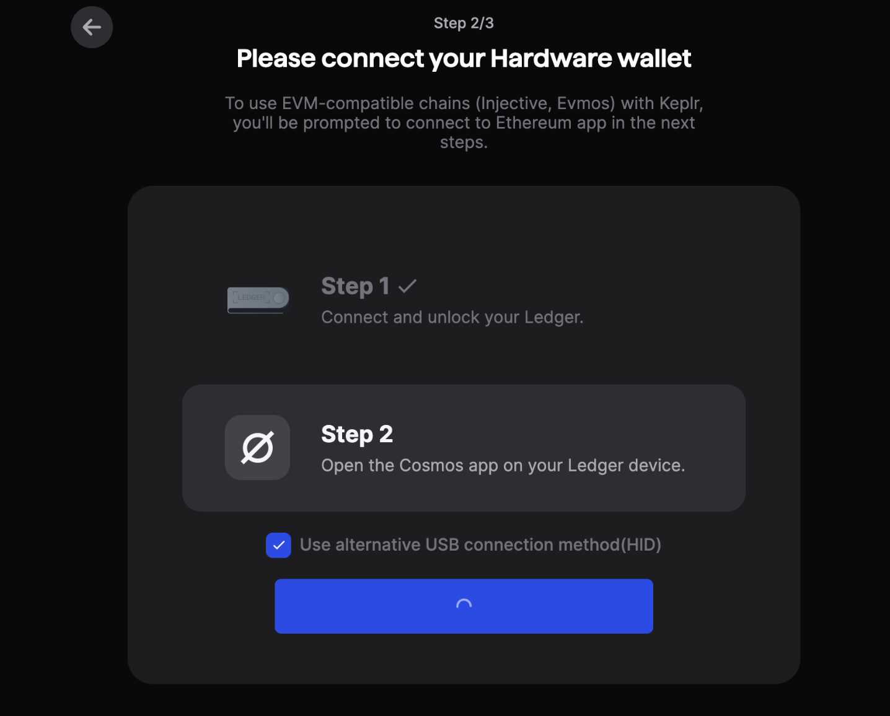
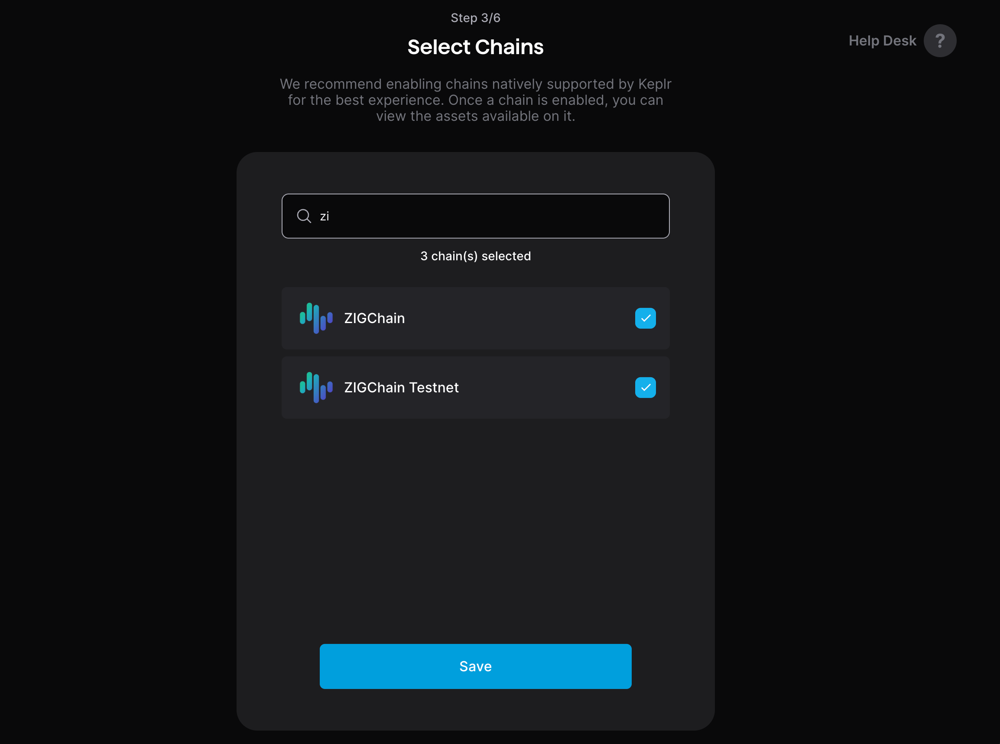
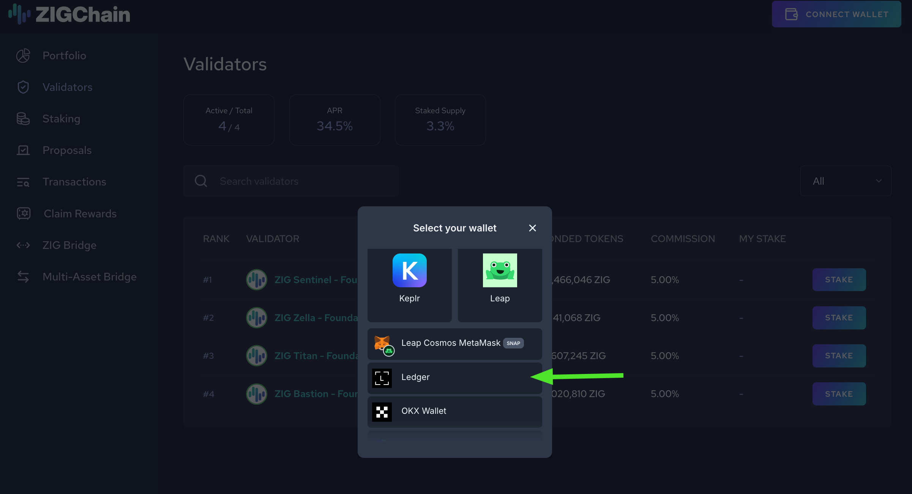
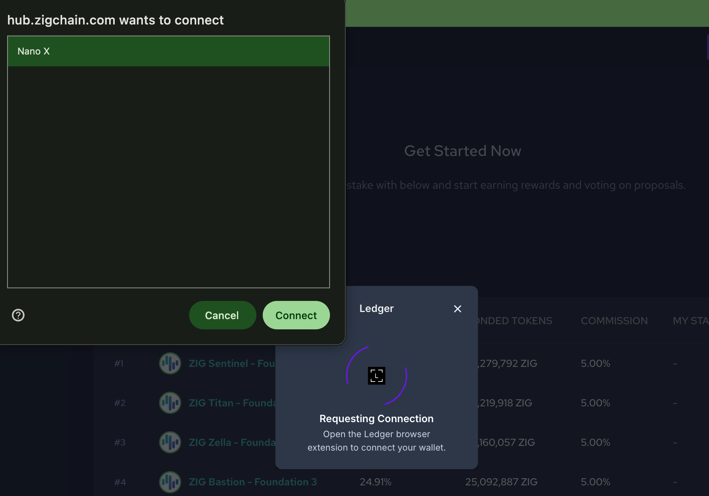
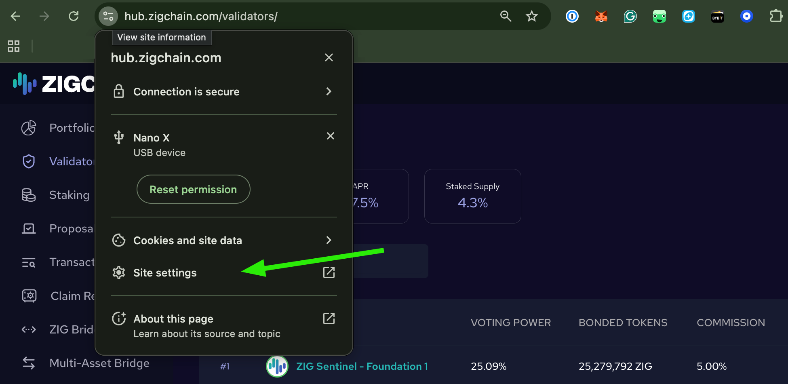

import Tabs from '@theme/Tabs';
import TabItem from '@theme/TabItem';

# Set up Ledger wallet for ZIGChain

ZIGChain supports Ledger for secure key storage and USB-based transaction signing via the **Cosmos (ATOM)** Ledger app.
This guide covers prerequisites, installing the Cosmos app, connecting Ledger with Keplr (and notes for Leap), using
Ledger on the ZIGChain Hub, and troubleshooting common connection issues.

## Before you start

Make sure all of the following are true:

- You've initialized your Ledger device.
- Your Ledger firmware and Ledger Live are up to date.
- You have Ledger Live installed for your operating system. (See the [official setup](https://www.ledger.com/start))
  at the Ledger website.
- You have ZIG tokens in ZIGChain format (not ERC20). If your ZIG is still on Ethereum, you need to bridge it first. See [Bridge Tokens](../zigchain_hub/bridge.md).

## Install the Cosmos app on Ledger

1. Connect and unlock your Ledger device.
2. Open **Ledger Live**.
3. Open **My Ledger** tab (left-hand navigation).
4. In the app catalog, search for **Cosmos (ATOM)**.
5. Click the **Install** button.

## Add Ledger to your Cosmos wallet (Keplr guide)

Keplr and Leap are the most popular Cosmos wallets. Ledger also works with other wallets that support Cosmos-based
tokens such as ZIG. If you need help adding ZIGChain to a wallet, see [Add ZIGChain to Wallet](./zigchain-wallet.md).

The following steps guides on how to connect with the Ledger using Keplr wallet.

> - Even if your Keplr password is compromised, transactions cannot be sent without your Ledger device and PIN.
> - Using Leap instead of Keplr? Check Leap article [Connecting to Leap using Ledger](https://www.leapwallet.io/support/connect-to-leap-using-ledger)

### Connect Ledger in Keplr

1. Connect and unlock your Ledger device, then **open the Cosmos app** on the device.
2. Open the **Keplr** browser extension and unlock with your password.
3. Add a new wallet by selecting "Connect Hardware Wallet".

4. Choose **Connect Ledger**.

5. Follow the specified steps on your ledger, then click **Next**.

6. On **Select Chains**, search for **ZIGChain**, tick the checkbox, then click **Save**. If you want to enable a testnet wallet as well, you can also select ZIGChain Testnet.

7. Keplr will create a wallet that is backed by your Ledger device.
8. You are now ready to receive and send ZIG, and later sign transactions with Ledger.

## Connect Ledger on the ZIGChain Hub

You can connect via **Keplr** or **Leap** if your Ledger account is already added there, or connect directly with **Ledger**.

**Steps for connecting directly with Ledger**

1. Connect and unlock your Ledger device.
2. Go to the ZIGChain Hub and click **Connect Wallet**.
3. On **Select you wallet**, select **Ledger**.

4. When prompted, grant the site permission to access your Ledger device.

You can now stake with validators, claim rewards, bridge tokens, and more, all with Ledger-secured signing.

## Troubleshooting

Ledger connections can occasionally fail due to USB, browser, or permission conflicts.  
Try the steps below in order.

**Quick checks**

- Close Ledger Live completely before connecting in the browser.
- Keep the Cosmos app open on Ledger during the entire connection.
- Use a direct USB cable, not a hub or dock. Try a different cable/port if possible.
- In macOS, if prompted, allow the browser USB permission. In Windows, ensure the Windows Security prompt is accepted.

**Reset site permissions in Chrome (ZIGChain Hub)**

1. Open the Hub page.
2. Click the **site lock icon** in the address bar → **Site settings**.
   

3. Click **Clear data** and confirm.
4. Reload the page.
5. Click **Connect**, pick your Ledger account, and approve on the device.

**Reset the wallet connection**

1. In the Hub, disconnect your wallet connection.
2. Close all Hub tabs.
3. Open a new browser.
4. Reconnect using Ledger or Keplr/Leap with Ledger.
