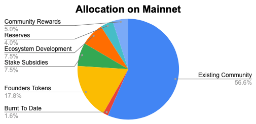
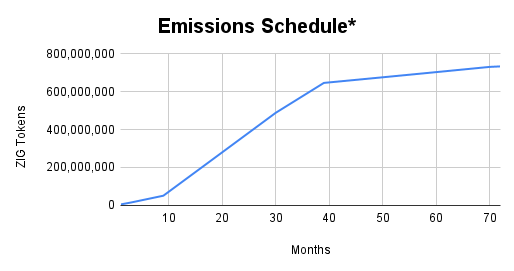

# The ZIG Token

**ZIG** is the **Native Utility Token** of the **ZIGChain ecosystem**.

## Tokenomics and Utilities

ZIG is fundamental to ZIGChain's economic model, offering multiple utilities that drive ecosystem participation, growth, and sustainability

### 🛡️️ Blockchain Consensus

1. **Secure the network** by running a validator & attracting stake to your validator
2. **Earn rewards** for validating transactions & share with those who have delegated to your validator

### 💰 Transaction Fees

1. **Gas fees** power network operations and smart contract executions

### 🗳️ Governance

1. **Proposal creation** for new features or protocol changes
2. **Voting rights** in blockchain upgrades
3. **Proposal creation** for new features or protocol changes

### 🔄 ModFee (Module Fees)

1. **Fees** from usage of blockchain modules \- Token Factory, Exchange Module & Wealth Management Module
2. **Fees** are, subject to consensus, applied either towards **Buyback and burn** or **reinvested** into the ecosystem development and user incentives

### 💼 Native DeFi Asset

1. **Native** currency for DeFi activities, such as liquidity provision, collateral for lending/borrowing, and protocol rewards

## ZIG Token Distribution

**Allocations on Mainnet**

| **Allocations on Mainnet** | **2,500,000,000** | **100.00%** |
| :------------------------- | ----------------- | ----------- |
| Existing Community         | 1,413,940,444     | 56.56%      |
| Burnt To Date              | 41,059,556        | 1.64%       |
| Founders Tokens            | 445,000,000       | 17.80%      |
| Stake Subsidies            | 187,500,000       | 7.50%       |
| Ecosystem Development      | 187,500,000       | 7.50%       |
| Reserves                   | 100,000,000       | 4.00%       |
| Community Rewards          | 125,000,000       | 5.00%       |

**Total Supply BreakUp (On Mainnet)**

| **Total Supply BreakUp (On Mainnet)** | **2,500,000,000** | **100.00%** |
| :------------------------------------ | ----------------- | ----------- |
| Circulating Supply (On Mainnet)       | 1,726,440,444     | 69.06%      |
| Burnt To Date                         | 41,059,556        | 1.64%       |
| Founders Tokens\*                     | 445,000,000       | 17.80%      |
| ZIGChain Foundation\*                 | 100,000,000       | 4.00%       |
| Stake Subsidies\*                     | 187,500,000       | 7.50%       |

**\*Subject to lock ups, vestings and economic conditions being met - see Emmissions schedule**

**Circulating Supply BreakUp (On Mainnet)**

| **Circulating Supply BreakUp (On Mainnet)** | **1,726,440,444** | **69.06%** |
| :------------------------------------------ | ----------------- | ---------- |
| Community                                   | 1,413,940,444     | 56.56%     |
| ZIGChain Foundation: Ecosystem Development  | 187,500,000       | 10.86%     |
| ZIGChain Foundation: Community Rewards      | 125,000,000       | 7.24%      |

Aligning the token structure with our transformative vision positions ZIG at the heart of a thriving ecosystem. By holding and using ZIG, you're not just transacting — you’re actively contributing to a future where wealth generation is accessible to all.

## Official Links

- CoinMarketCap: https://coinmarketcap.com/currencies/zigcoin

- CoinGecko: https://www.coingecko.com/en/coins/zignaly
