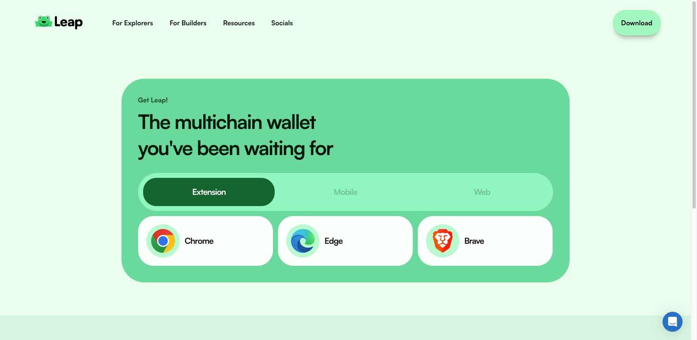

# **Get a ZIGChain Wallet**

ZIGChain is available on several crypto wallets, most prominent being Leap and Keplr. Follow the steps below to get your ZIGChain Wallet.

ZIGChain is available on two networks:

- **Mainnet**: the primary blockchain, where transactions have real economic value.

- **Testnet**: a testing environment for developers and users to experiment without risk.

## **Leap Wallet**

### **Add ZIGChain Mainnet in Leap**

1. Install the [**Leap Wallet extension**](https://www.leapwallet.io/download) compatible with your browser.

   

2. Create a new wallet or import an existing one.

If you create a new wallet, securely back up your recovery phrase and never share it with anyone.

3\. Once your wallet is set up, click on the **“All Chains”** menu (represented by four squares or the name of your current chain).

4\. Search for **“ZIGChain”**, mark it as a favorite using the star icon, and select it to switch.

✅ Your wallet is now connected to **ZIGChain Mainnet**.

### **Switch to ZIGChain Testnet in Leap**

1. While on ZIGChain Mainnet, open the **menu (three lines)** on the left side of the wallet.

2. Scroll down to **Network**, then select **Testnet**. You will automatically switch to the ZIGChain Testnet.

3. A confirmation will appear with a blue notification at the top of the wallet.

To receive tokens on Testnet, visit the [**ZIGChain Faucet**](https://faucet.zigchain.com/), connect your wallet, and claim tokens. You can request tokens once per day.

### **Troubleshooting**

If ZIGChain is not visible as a chain option in your Leap Wallet, ensure that you are using **Leap Wallet version 0.22.7** or higher. Older versions may not support ZIGChain. [Update your wallet extension to the latest version](https://www.leapwallet.io/support/update-my-leap-wallet-to-the-latest-version) to access ZIGChain.

## **Keplr Wallet**

### **Add ZIGChain Mainnet in Keplr**

1. Install the [**Keplr Wallet extension**](https://www.keplr.app/get) compatible with your browser.

2. Create a new wallet or import an existing one.  
   If you create a new wallet, securely back up your recovery phrase and never share it with anyone.

3. In the setup flow, select **ZIGChain** and click **Save**.

4. To confirm ZIGChain is enabled, open the **menu (three lines)**, go to **Add/Remove Chains**, and ensure that **ZIGChain** is toggled on.

✅ Your wallet is now connected to **ZIGChain Mainnet**.

### **Switch to ZIGChain Testnet in Keplr**

1. Open the **menu (three lines)** and go to **Add/Remove Chains.**

2. Toggle on the option **ZIGChain Testnet**.

To receive tokens on Testnet, visit the [**ZIGChain Faucet**](https://faucet.zigchain.com/), connect your wallet, and claim tokens. You can request tokens once per day.

