# ZIGChain Bridge

The [ZIGChain Bridge](https://hub.zigchain.com) makes it simple to move your assets across chains — quickly, affordably, and securely.

You can easily transfer **ZIG, USDC, and other supported tokens** between **ZIGChain** and multiple networks in just a few clicks.

## General overview

The bridge interface has three main areas:

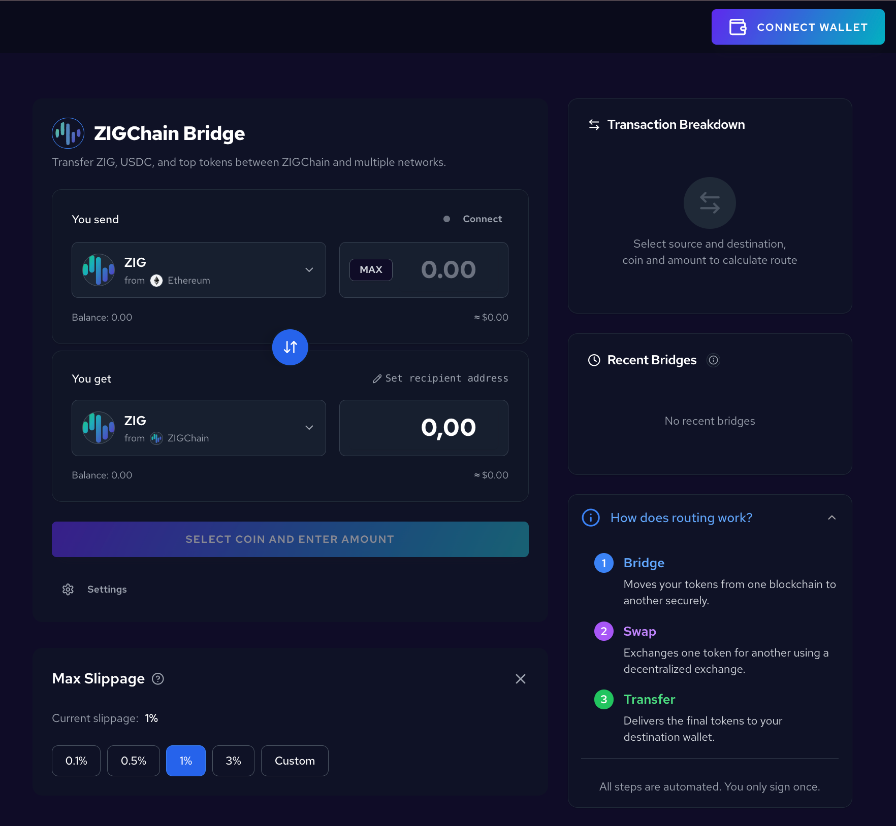

### Central panel

- **"You send"** and **"You get"** — Choose the token and network on each side.
- Use the **arrow button** between them to swap direction.
- Enter an amount or **MAX**; optionally **Set recipient address** in **"You get"**.
- The main action button is **BRIDGE** (or **SELECT COIN AND ENTER AMOUNT** until a route is ready).

### How routing works

In the right panel, expand **"How does routing work?"** to see the three automated steps:

1. **Bridge** — Moves your tokens between chains.
2. **Swap** — Exchanges via a DEX if needed.
3. **Transfer** — Delivers to your destination wallet.

You only sign once.

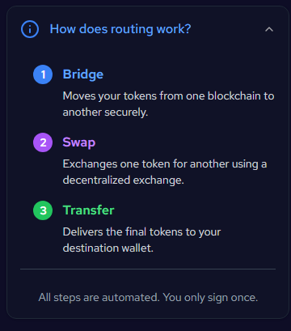

### Settings

Open **Settings** at the bottom of the bridge panel to set **Max Slippage** (0.1%, 0.5%, 1%, 3%, or Custom). Adjust this before large or time-sensitive transfers.

> **Slippage** is the maximum difference you accept between the estimated amount you see and the amount you actually receive. It can happen when prices move between when you submit the transaction and when it settles.

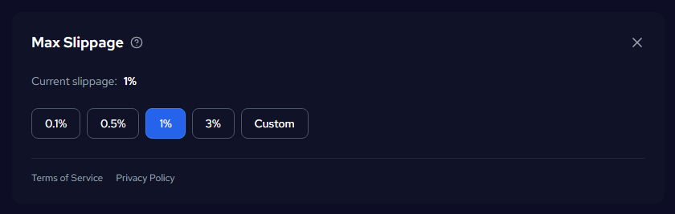

---

## Bridge steps

### 1. Click Connect Wallet

On the main bridge interface, click the **CONNECT WALLET** button in the top right corner.

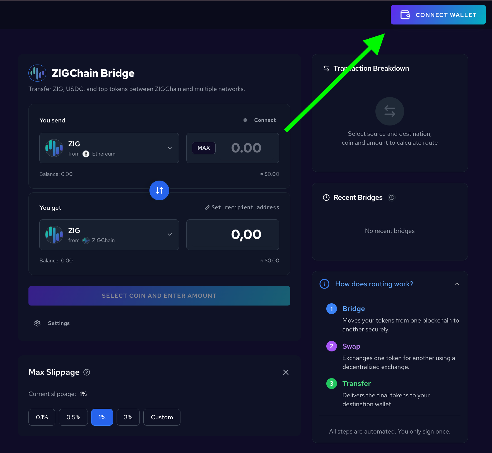

### 2. Select your wallet provider

A modal appears with wallet options. Choose your wallet (e.g. **Keplr**, **Leap**) and follow the prompts to connect. Your balance will show once connected.

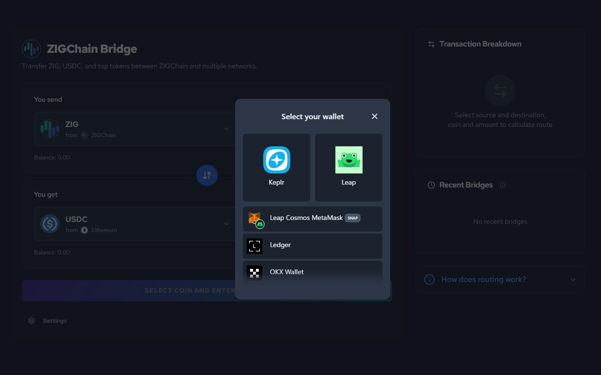

### 3. Select the token you want to bridge

In the **"You send"** section, click the token dropdown to open the asset list. Search or browse, then pick the token you want to send. When you select a token, choose the **source network** (e.g. ZIGChain, Ethereum, Cosmos Hub) from the supported networks list.

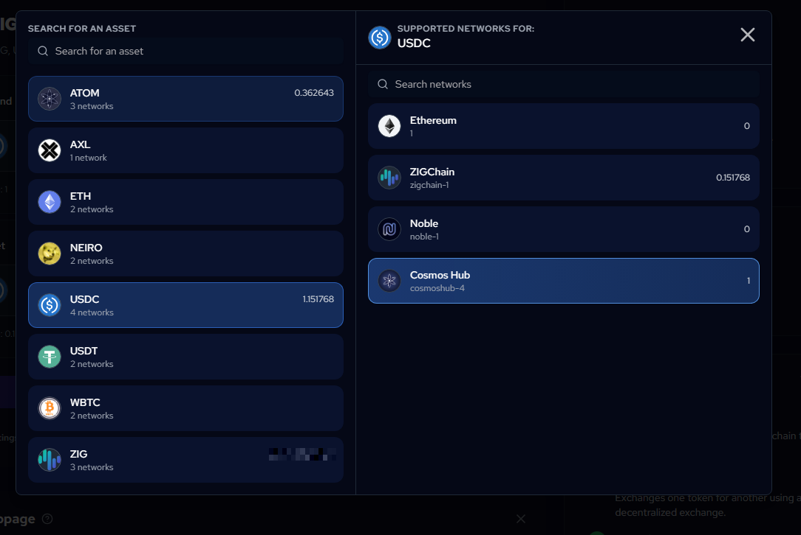

### 4. Select the token you want to receive ("You get")

In the **"You get"** section, pick the token and network you want to receive. Use the same flow: choose the asset, then the destination network. This defines what you will receive on the other side.

### 5. Enter amount, review breakdown, then click Bridge

Enter the amount you want to bridge in the **"You send"** field, or click **MAX** to use your full balance. The **"You get"** side will show the estimated amount you’ll receive.

On the right, check the **Transaction Breakdown** for route, recipient, duration, and fees.

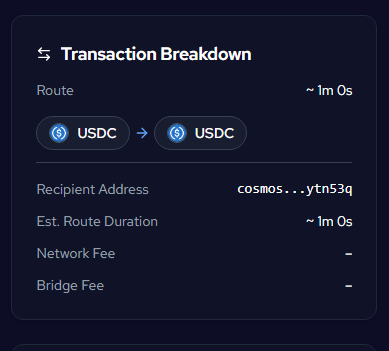

You can **change the wallet address** that will receive the funds: click the **Wallet** field in the **"You get"** section (next to the pencil icon) to set or edit the destination address.

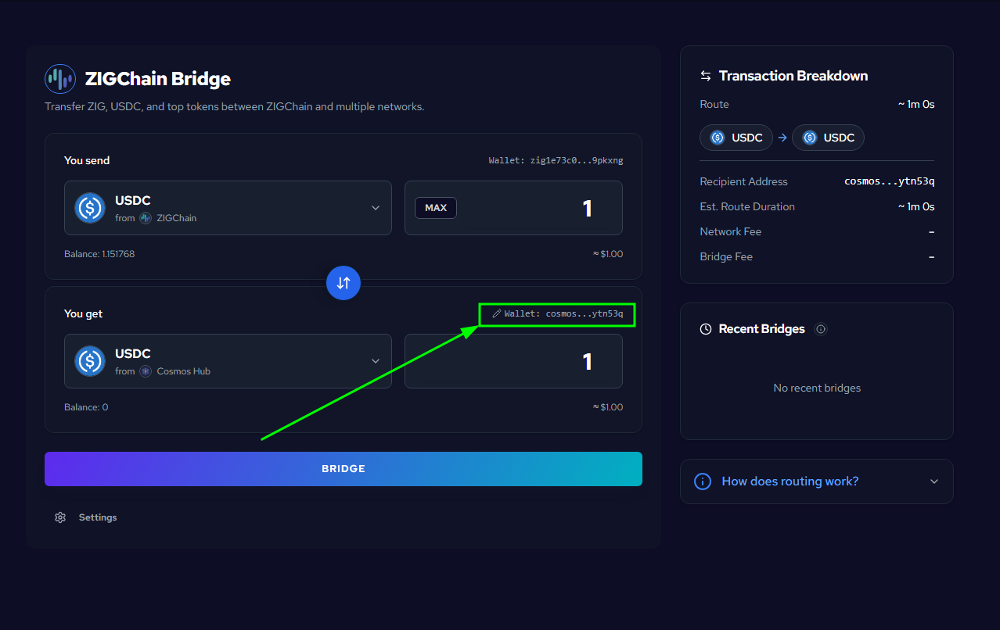

You can open **Settings** and set **Max Slippage** (0.1%, 0.5%, 1%, 3%, or Custom) if you want to control how much price movement you accept.

When everything looks correct, click the **BRIDGE** button to start the process.

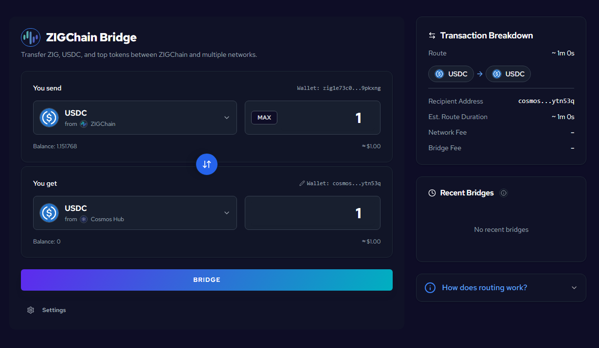

### 6. Transfer in progress

After you click **BRIDGE**, the button changes to **EXECUTING...** with a loading spinner while the transfer is in progress.

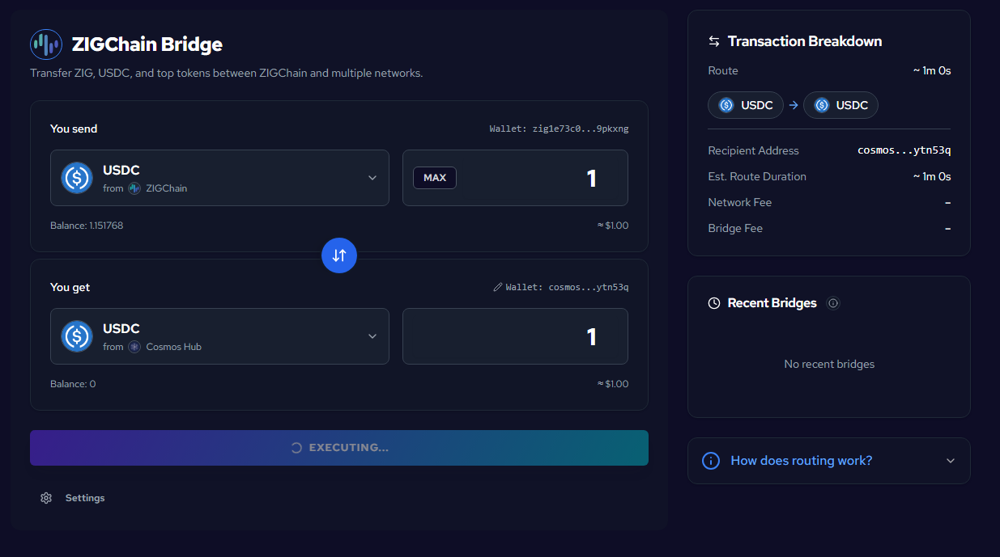

### 7. Approve the transfer in your wallet app

Your wallet app will ask you to approve the transaction. Review the request (fees and destination), choose a fee level (Low, Medium, or High) if shown, then tap **Approve** to confirm. Use **Reject** to cancel.

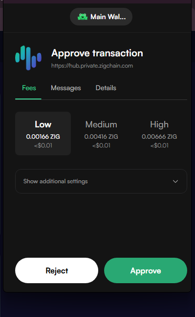

### 8. Monitor transfer in Recent Bridges

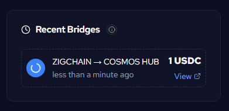

Once the transaction is initiated, check the **Recent Bridges** section on the right. Your transfer will appear with the route (e.g. ZIGCHAIN → COSMOS HUB), the amount, and a loading indicator. Use **View** to see more details.

### 9. Confirm completion

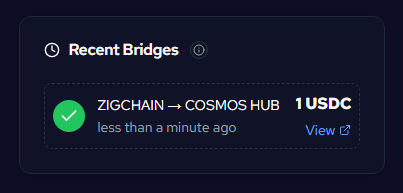

When the bridge finishes, the same entry in **Recent Bridges** will show a **green checkmark**. Your tokens have been bridged successfully.

🎉 You've successfully bridged your assets using **ZIGChain Hub!**

### Starting another bridge

To start a new bridge, select the desired token and network, then enter the amount. While a transfer is in progress or right after it completes, the **BRIDGE** button is hidden. As soon as you enter a new amount, the **BRIDGE** button is available again and you can start the next transfer.

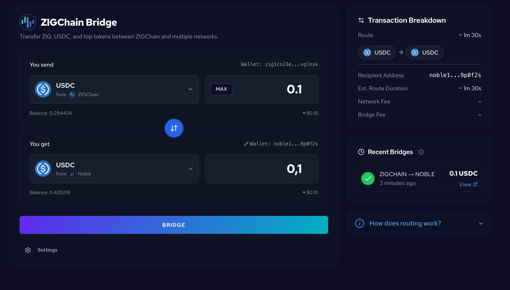
