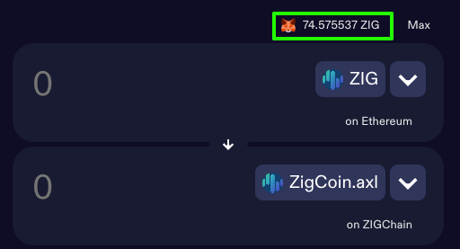
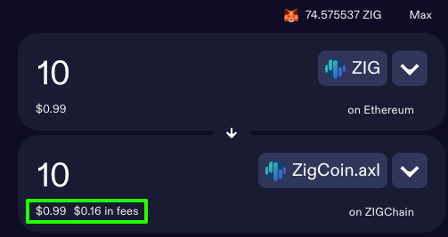
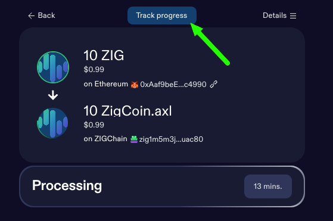

# Bridge

The [ZIGChain Bridge](https://hub.zigchain.com) makes it simple to move your assets across chains — quickly, affordably, and securely.  
You can easily transfer **ZIG, USDC, and other supported tokens** between **ZIGChain** and multiple networks in just a few clicks.

---

## How It Works — Step by Step

### 1. Link your origin wallet

- Start by connecting the wallet that currently holds your tokens — your **origin wallet**.  
  Choose the **asset** and the **networks** you’ll use for this transaction, following a simple “**From → To**” logic.

  _Example:_ Bridging ZIG from your Ethereum wallet (**origin**) to your ZIGChain wallet (**destination**).

- Click **Connect Wallet** to link your wallet to the ZIGChain Hub.  
  Once connected, you’ll see the **maximum transferable amount** for the selected token displayed on top.

---

### 2. Enter a valid amount

- In the upper panel, enter the amount you’d like to bridge.  
  You can also click **Max** to send all available tokens.

  💡 **Tip:** Ensure you have enough native currency (like **ETH** on Ethereum) to cover **gas fees**.

- Next, review:

  - The amount you’ll receive, and
  - The estimated bridge fee, which updates automatically based on network conditions.

- When ready, click **Send**.

---

### 3. Set your destination wallet

Now it’s time to connect the wallet that will receive your tokens — your **destination wallet**.

- Click the large **Set Destination Wallet** button and follow the prompts to connect.  
  Before confirming, carefully review all transaction details.

- When everything looks correct, click **Confirm**.

- Your **origin wallet** will then prompt you to approve the transaction.  
  Some wallets may require **multiple confirmations**, so keep an eye on your wallet notifications.

---

### 4. Wait and track

- Your transfer is now on its way.  
  Processing may take around 20 minutes depending on network traffic.

- While you wait, you can monitor the status:
  - Click **Track Progress** to open the transaction in the **Skip Explorer**.
  - The status will show as _Pending_ until the process completes.

---

### 5. Confirm receipt in your destination wallet

- Once the transaction is finalized, your bridged assets will appear automatically in your **destination wallet**.

🎉 You’ve successfully bridged your assets using **ZIGChain Hub!**

---

## Additional Tips

- Double-check addresses before confirming any transaction.
- Keep a small balance of gas tokens for smooth bridging.
- For ZIG from Ethereum, choose **ZigCoin.axl** — it automatically converts to **native ZIG** on ZIGChain.
