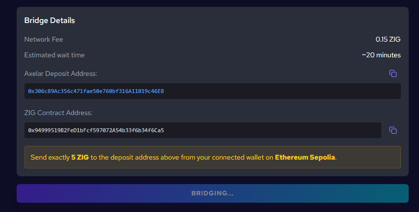

# Bridges on ZIGChain Hub

ZIGChain Hub now provides two dedicated pages for asset transfers. Use the left navigation menu to choose the experience that matches your transfer:

1. **ZIG Bridge**: Bridge the ZIG token between Ethereum (ERC‑20) and ZIGChain using Axelar.
2. **Multi-Asset Bridge**: Transfer **USDC** and top tokens between ZIGChain and multiple networks using the Skip widget (e.g., Cosmos Hub, Noble, EVM/ERC‑20, and more).

## ZIG Bridge (Axelar)

Open: [ZIG Bridge](https://hub.zigchain.com/bridge/)

The ZIG Bridge page focuses on a streamlined Axelar-powered flow to transfer ZIG between Ethereum and ZIGChain.

### How it works

1. **Connect wallets**

   - In the left panel (Ethereum), click **CONNECT EVM WALLET** , select the desired wallet and approve it.
   - In the right panel (ZIGChain), click **CONNECT WALLET** , select the desired wallet and approve it.

2. **Enter amount**

   - In the left panel, type the ZIG amount under **Amount**.
   - Optionally click **Max** to transfer all your tokens. Make sure you have ETH for gas.
   - In the right panel, review the amount to be received under **You will receive** and the estimated **Bridge fee**. These update automatically based on the amount and network conditions.

3. **Start the transfer**

   - Click the large **TRANSFER** button.
   - The button becomes disabled and shows **Preparing…** while the route is set up.
   - A **Bridge Details** panel appears showing: **Network Fee**, **Estimated wait time**, the **Axelar Deposit Address** (with copy), and the **ZIG Contract Address**, plus an instruction to send the exact amount.
   - Your wallet (e.g., MetaMask) opens. Review and click **Confirm** to send.

4. **Wait and track**

   - The transfer is routed through Axelar. Processing typically takes 10–30 minutes.
   - Under the **Bridge Details** panel, a banner appears: **Transaction sent!** with a **View on Explorer** link. Your transfer will appear on **Axelar Scan** in ~20 minutes.
   - Track progress on Axelar Scan (link shown) or in the Recent Transfers list.

5. **Receive on ZIGChain**

   - When finalized, your ZIG appears in your connected ZIGChain wallet.
   - Typical processing time: 10–30 minutes (subject to network conditions).

### Recent Transfers

Use the **Recent Transfers** section (below the How It Works panel) to view your history and status:

- **Status**: Approved, Pending, or Failed
- **Received / Date**: Amount credited and timestamp
- **Source Chain**: Origin network for the transfer
- **Transaction**: Link to view the transaction on the explorer

## Multi-Asset Bridge (Skip)

Open: [Multi‑Asset Bridge](https://hub.zigchain.com/multi-asset/)

The Multi-Asset Bridge page integrates the Skip widget to bridge non‑ZIG assets between ZIGChain and multiple networks.

### Basic flow

1. **Select token (top section)**

   - Click the upper **Select asset** dropdown and choose your token.
   - After selecting a token, the widget immediately asks you to pick the network for that token.

2. **Select network (top section)**

   - In the prompt that follows, choose the source chain for the token you selected.

3. **Configure the second section**

   - In the lower section, select the destination token and destination network.

4. **Click Send**

   - Review settings if needed, then click **Send**.

   

5. **Confirm transaction details**

   - Review route, fees, and estimated time. Click **Confirm** to proceed.

   

6. **Approve in your wallet**

   - Approve the request in **Leap** or **Keplr** (or your chosen wallet).

7. **Track progress**

   - While processing, click **Track progress** to open the Skip details view.

   

   

8. **Receive on ZIGChain**
   
   - Once the transfer is finalized, your bridged tokens will appear in your wallet and can be viewed in 
the [Portfolio](https://hub.zigchain.com/portfolio/) section of the ZIGChain Hub.

