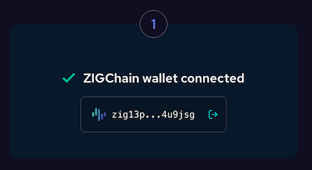
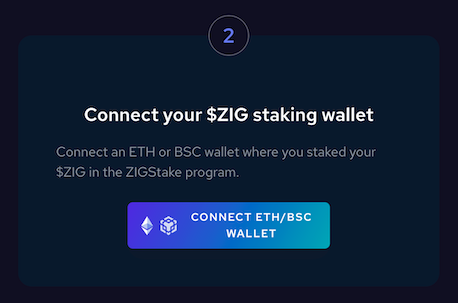
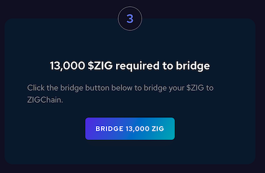
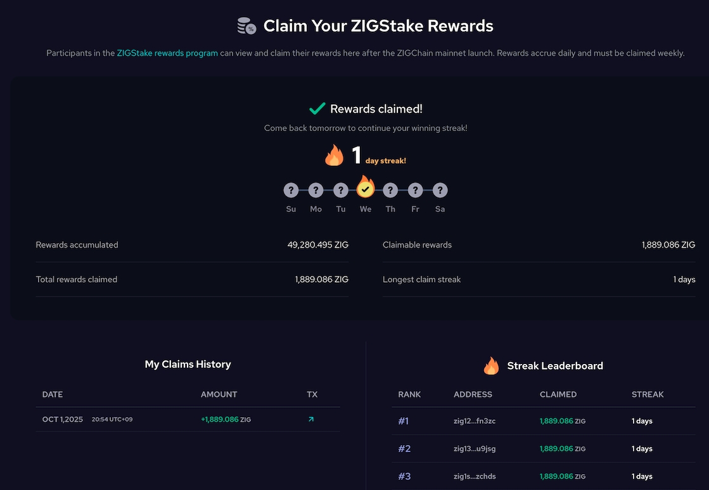

# ZIG Rewards Program

Welcome to the **ZIG Rewards Program**!

This guide explains how you can claim your staking rewards from our pre-mainnet staking program directly on the **ZIGChain Hub**.

---

## How It Works

Participants who staked their ZIG tokens on the [previous staking website](https://staking.zigchain.com/), either on Ethereum or BSC chains can now claim their rewards through the **Claim Rewards** section in the [ZIGChain Hub](https://hub.zigchain.com/claim-rewards/).

Please note that rewards:

- **Accumulate daily**
- Must be claimed within **72 hours** to avoid a **1% late penalty per day**
- Expire if not claimed within **7 days**

---

## Step 1: Connect Your ZIGChain Wallet

First, connect ZIGChain Mainnet wallet

- Click **Connect ZIGChain Wallet** in the Hub.
  - If you don't have one yet, [follow this guide on how to set up one](../general/zigchain-wallet.md).
- Accept the wallet prompts
- Confirm connection



All future rewards will be sent directly to this wallet.

---

## Step 2: Connect Your Previous Staking Wallet

Next, connect the wallet you originally used on _staking.zigchain.com_

- This must be the same wallet you used for staking ZIG on Ethereum or Binance Smart Chain
- Connect it in the Hub so the system can verify your staking history



---

## Step 3: Bridge Your Staked ZIG to ZIGChain

Before your initial staked amount appear visible in your wallet, you'll need to use the **Bridge**:

- Bridge your ZIG from Ethereum or ZIGChain
  - If you have not unstaked, you will be prompt to unstake first
  - **Important**: You must bridge at least **90%** of your last non-zero staked amount to remain eligible for rewards
  - **Note**: Make sure to unstake from both ETH and BSC if you have been staking with both.
- Once bridged, your tokens will become visible in your **ZIGChain** wallet. Make sure you are on the mainnet network



### Verify Eligibility (90% of Non-Zero Staked Amount Rule)

To be eligible to receive rewards, either A or B must be true

**A) Bridge Amount ≥ 90% of Last Staked Amount**  
We first check if the total bridged to ZIGChain is ≥ 90% of your last non-zero staked amount.

If A is not met, we check B:

**B) Current ZIGChain Holdings ≥ 90% of Last Staked Amount**  
We compute your current balance on ZIGChain as:

**ZIG balance** + **stZIG balance** + **amount you are directly staking with validators on ZIGChain**.

> Note: `stZIG` is a liquid staking derivative that represents ZIG staked via Valdora. It remains transferable while accruing staking rewards, allowing you to use liquidity without fully unstaking. For a concise overview, see Valdora’s post on X: https://x.com/Valdora_finance/status/1958574048926941553

If this sum is ≥ 90% of your last staked amount, you’re eligible.

- If A or B is true, you can start claiming.
- If both are false, you’ll need to unstake / bridge / acquire more ZIG until you reach the 90% threshold.

**Examples**

**Example 1 – Eligible via Bridge**

- Last staked amount: **10,000 ZIG**
- Bridged to ZIGChain: **9,500 ZIG**
- 90% of 10,000 = **9,000 ZIG** → **Eligible** (**A** is true)

**Example 2 – Eligible via Current Holdings**

- Last staked amount: **10,000 ZIG **
- Bridged so far: **5,000 ZIG** (**A** is false)
- Current ZIGChain balances:
  - ZIG wallet: **1,000 ZIG**
  - stZIG: **3,000 ZIG**
  - Directly staked on validators: **5,000 ZIG**
- Sum = 1,000 + 3,000 + 5,000 = **9,000 ZIG** → **Eligible** (**B** is true)

**Example 3 – Not Eligible Yet**

- Last staked amount: **10,000 ZIG**
- Bridged: **5,000 ZIG**
- Current balances (ZIG + stZIG + directly staked): **3,800 ZIG**
- Sum = 5,000 + 3,800 = **8,800 ZIG** (**< 9,000 ZIG**) → **Not eligible**
- **Action**: Unstake, bridge, or add ZIG until total **≥ 9,000 ZIG**

---

## Step 4: Claim Your Daily Rewards

🎉 Now you’re ready to claim!

- Rewards become available daily
- You must claim within **72 hours** or a **1% penalty** applies each day
- After **7 days**, unclaimed rewards will expire



### 1% Penalty Explained

From the fourth day onward, each new day’s reward is slightly reduced if you haven’t claimed yet. The reduction grows by
1 percentage point per day after the first 72 hours and the reward expires after 7 days left unclaimed. When you claim, the counter resets.

**How it works**

- Daily reward = Reward ÷ 180.
- Penalties apply per day’s reward based on how many days have passed since it accrued (and since your last claim).
- **No penalty** for the first **72 hours** (Days 1–3).
- Starting **Day 4**, the day’s reward is reduced by **N%**, where **N = days since your last claim − 3**:
  - Day 4 → -1% of that day’s reward
  - Day 5 → -2%
  - Day 6 → -3%
  - Day 7 → -4%
- Each day’s reward **expires after 7 days** if not claimed.
- **Claiming resets the counter**. After you claim, the next three days again have 0% penalty, then the 1% penalty
  resumes if the reward is left unclaimed.

**Example**

- Program start date: 2025-11-05
- Total reward: 1,800 ZIG
- Base daily reward: 1,800 ÷ 180 = 10 ZIG/day

| Day | Date       | Age since accrual | Penalty on that day’s 10 ZIG | Claimable that day (ZIG) | Cumulative if you claim **that day** |
| --: | ---------- | :---------------: | :--------------------------: | -----------------------: | -----------------------------------: |
|   1 | 2025-11-05 |      0 days       |              0%              |                 **10.0** |                             **10.0** |
|   2 | 2025-11-06 |       1 day       |              0%              |                 **10.0** |                             **20.0** |
|   3 | 2025-11-07 |      2 days       |              0%              |                 **10.0** |                             **30.0** |
|   4 | 2025-11-08 |      3 days       |           **−1%**            |                  **9.9** |                             **39.9** |
|   5 | 2025-11-09 |      4 days       |           **−2%**            |                  **9.8** |                             **49.7** |
|   6 | 2025-11-10 |      5 days       |           **−3%**            |                  **9.7** |                             **59.4** |
|   7 | 2025-11-11 |      6 days       |           **−4%**            |                  **9.6** |                             **69.0** |

Keeping your daily streak is essential — claim every day to maximize rewards, avoid penalties, and climb the leaderboard!

---

## FAQs

1. **My ZIGs are still on the BSC network but I can only bridge from ERC20 to ZIGChain. What should I do to claim my rewards?**

If your ZIG tokens are currently on BSC (BEP20), you need to bridge in two steps: first from BEP20 to ERC20, and then from ERC20 to ZIGChain. You can send ZIG tokens to an ERC20 address using an exchange that supports both networks like MEXC. Once your ZIGs are on the ERC20 network, you can bridge them to ZIGChain as usual and claim your rewards.

For more bridging methods, refer to this [link](https://medium.com/@zignaly/be-mainnet-ready-a-step-by-step-guide-to-bridge-zig-to-erc-20-from-bnb-sol-pol-inj-cex-10fbbef98ad2#96f7).

2. **I sent my ZIG to ERC20 through an exchange instead of the official bridge. Can I still claim my staking rewards?**

Yes! As long as your tokens arrive in your connected ZIGChain wallet, you can still claim your staking rewards.
We verify the balance in your ZIGChain wallet, not the specific method you used.

3. **I’ve staked ZIG using different wallets. Do I need to connect each one?**

Yes. If you staked from multiple wallets or networks, each one needs to be linked separately to its own ZIGChain wallet. This ensures that every staking position is recognized correctly and rewards are properly assigned.

4. **I unstaked my tokens in two separate transactions. Will I still get all my rewards?**

Yes — as long as you meet the 90% requirement for your final unstake.
For example, if you first unstaked 25% and later unstaked 75%, you need to bridge 90% of that last 75% portion to remain eligible for rewards.

5. **Can I bridge my tokens in parts, or do I need to do it all at once?**

You can bridge your tokens in multiple transactions. As long as the total amount reaches your ZIGChain wallet, it will count toward your eligibility for staking rewards.

6. **My staking wallet was on BEP20, but now I’m using ERC20. Do the wallet addresses need to match?**

They don’t have to be identical. What matters is that the final ZIGChain wallet receives the tokens.
You can send funds from your BEP20 or ERC20 address — just make sure they end up in your ZIGChain wallet.
To claim your rewards, ensure that you connect your BEP20 wallet.

7. **Are there any special rewards for long-term stakers who later unstake?**

No. All users follow the same staking reward process.

8. **I used a different process to bridge or my balance looks off. What should I do?**

Don’t worry — as long as your ZIGChain wallet shows the correct balance, you’ll still be eligible. The system verifies funds that arrive in your ZIGChain wallet, even if they were sent through different routes.
If you notice any issues, contact support through [Discord](https://discord.com/invite/zignaly-the-better-way-to-invest-in-crypto-486954374845956097).

9. **How can I calculate my daily staking rewards?**

It’s simple!
Go to the [Data index](https://staking.zigchain.com/data/index.html) on [staking.zigchain.com](https://staking.zigchain.com/) and check your average share percentage. Multiply that percentage by 70,000,000 ZIG, which is the total reward pool. Then divide the result by 180 days, which is the period over which rewards are distributed.

Example

If your average share is **0.00592%**, here’s the calculation:

```bash
    (0.00592% × 70,000,000)÷180
    70,000,000 × 0.0000592 = 4,144
    4,144 ÷ 180 = ≈ 23.02 ZIG per day
```

✅ Your estimated daily reward ≈ 23 ZIG

10. **When can I start claiming rewards?**

November 5th, 2025.
