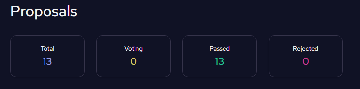
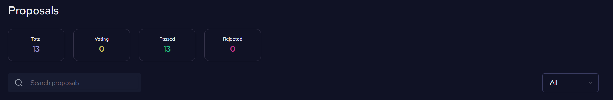
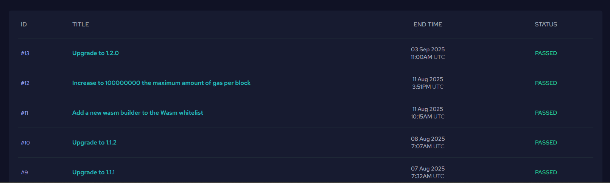
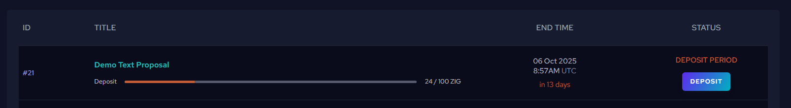
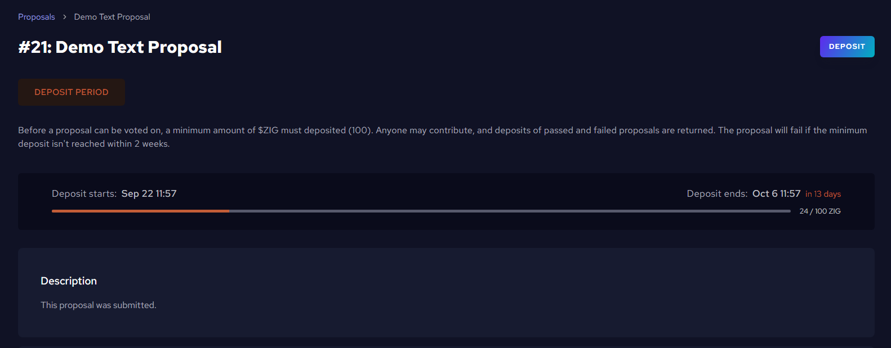
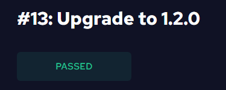
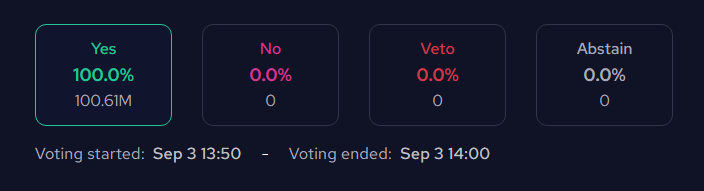
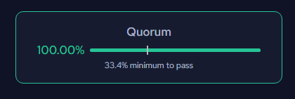

# Governance Proposals on ZIGChain Hub

The [Proposals page](https://hub.zigchain.com/proposals/) on ZIGChain Hub allows you to view, explore, and vote on governance proposals. You can browse proposals, search for specific ones, view detailed information about each proposal's status and results, and participate in governance by voting on active proposals.

> 📋 **Note**: For detailed information about governance processes, proposal types, and voting mechanics, see the [Governance documentation](../general/governance/governance.md).

## Understanding the Proposals Page

When you visit the [Proposals page](https://hub.zigchain.com/proposals/), you'll see a comprehensive overview of all governance proposals with the following features:

### Summary Cards

At the top of the page, you'll see four summary cards showing:

- **Total**: Total number of proposals
- **Voting**: Number of proposals currently in voting period
- **Passed**: Number of proposals that have been approved
- **Rejected**: Number of proposals that have been rejected

### Search and Filter Options

- **Search Bar**: Use the search function to find specific proposals by title
- **Filter Dropdown**: Use the dropdown to filter by status (All, Active)

### Proposals Table

The main table displays all proposals with the following columns:

- **ID**: Unique proposal identifier (e.g., #13, #12, #11)
- **Title**: Brief description of the proposal (e.g., "Upgrade to 1.2.0")
- **End Time**: When the current status ended or will end (date and time in UTC)
- **Status**: Current state of the proposal

### Proposal Statuses

The Hub displays the current status of each proposal:

- **Deposit Period**: Proposal is gathering deposits to enter the voting phase
- **Voting Period**: Proposal is currently in the voting period where community members can cast votes
- **Passed**: Proposal was approved by the community and met all requirements
- **Rejected**: Proposal was not approved (failed to meet quorum or majority requirements)
- **NoWithVeto**: Proposal was rejected due to strong community opposition (veto threshold exceeded)

## How to Explore Proposals

### Step 1: Access the Proposals Page

1. Go to the [Proposals page](https://hub.zigchain.com/proposals/).
2. You'll see the summary cards showing the total count of proposals and their status distribution.

### Step 2: Browse and Search Proposals

1. **Use the Search Bar**: Type keywords to find specific proposals (e.g., "upgrade", "gas", "wasm")
2. **Apply Filters**: Use the dropdown to filter by status (All, Active)
3. **Browse the Table**: Scroll through the list to see all proposals with their details

### Step 3: Review Proposal Details

1. **Click on any proposal row** in the table to open the detailed proposal view.
2. **Navigate to the detail page** where you can see comprehensive information about the proposal.
3. **Read through all sections** to understand:
   - What changes are being proposed
   - Why the changes are needed
   - Potential impact on the network
   - Complete voting results and timeline
   - Technical details and metadata

### Step 4: Deposit to Proposals in Deposit Period

If a proposal is in "Deposit Period", you can contribute ZIG tokens to help it reach the minimum deposit requirement:

1. **Check deposit status**: Look for the deposit progress bar showing current/target ZIG amount
2. **Review deposit requirements**: Minimum deposit amount and deadline are displayed
3. **Click "DEPOSIT"**: Use the button to contribute to the proposal
4. **Enter deposit amount**: Specify how many ZIG tokens you want to deposit
5. **Confirm the transaction**: Approve the deposit in your connected wallet
6. **View updated deposit**: Once approved, the deposit amount on the proposal will be updated with your contribution

> 📝 **Note**: Deposits for passed and failed proposals are returned. The proposal will fail if the minimum deposit isn't reached within the deposit period.

### Step 5: Vote on Active Proposals

If you have staked ZIG tokens and the proposal is in "Voting Period", you can participate in governance:

1. **Check if you can vote**: You need staked ZIG tokens to vote on proposals
2. **Review the proposal**: Read the details carefully before making your decision
3. **Cast your vote**: Choose from Yes, No, No with Veto, or Abstain
4. **Confirm the transaction**: Approve the vote in your connected wallet

> ⚠️ **Important**: If you don't vote, your vote will automatically follow your validator's choice. Only staked tokens count toward voting power.

### Step 6: Understand Proposal Information

When viewing a proposal detail page, you'll see:

#### Proposal Header

- **Proposal ID and Title**: Shows the proposal number and title (e.g., "#13: Upgrade to 1.2.0")
- **Status Badge**: Clear status indicator (PASSED, REJECTED, VOTING PERIOD, DEPOSIT PERIOD, etc.)

#### Voting Results Summary

- **Vote Distribution**: Four boxes showing the percentage and count for each vote type:
  - **Yes**: Votes supporting the proposal (with percentage and total count)
  - **No**: Votes opposing the proposal
  - **Veto**: Votes with veto power
  - **Abstain**: Neutral votes that contribute to quorum
- **Voting Timeline**: Shows voting start and end time

#### Quorum Information

- **Quorum Status**: Shows participation percentage with a progress bar
- **Minimum Threshold**: Displays the minimum quorum required for proposal to pass

#### Proposal Details

- **Description**: Brief overview of what the proposal aims to achieve
- **Details**:
  - **Metadata**:
  - **Title**: The proposal title
  - **Summary**: Summary of the proposal
  - **Proposer**: The address of who submitted the proposal

### Step 7: Stay Informed

- **Active Proposals**: Check proposals with "Voting Period" status to see current community decisions
- **Historical Proposals**: Review "Passed" and "Rejected" proposals to understand network evolution
- **Future Proposals**: Monitor "Deposit Period" proposals to see what's coming up
- **Vetoed Proposals**: Review "NoWithVeto" proposals to understand community concerns

## How Voting Works on the Hub

### Voting Requirements

- **Staked Tokens**: You must have ZIG tokens staked with an active validator to vote
- **Active Proposals**: You can only vote on proposals in "Voting Period" status
- **Connected Wallet**: Your wallet must be connected to the Hub to cast votes

### Voting Options

When voting on a proposal, you can choose from:

- **Yes**: Support the proposal
- **No**: Oppose the proposal
- **No with Veto**: Strongly oppose the proposal (can veto if enough votes)
- **Abstain**: Neither support nor oppose, but contribute to quorum

### Validator Delegation

- **Your Vote Counts**: If you vote, your choice overrides your validator's vote
- **Automatic Delegation**: If you don't vote, your vote automatically follows your validator's choice
- **Voting Power**: Your voting power equals the amount of ZIG tokens you have staked
- **Independent Choice**: You can vote differently from your validator if you disagree with their position

Start exploring governance now at [ZIGChain HUB Proposals](https://hub.zigchain.com/proposals/).

For detailed governance information, see the [Governance documentation](../general/governance/governance.md).
