# Staking on ZIGChain Hub

Staking is the best way to secure the ZIGChain network and earn rewards on your ZIG Token.  
Through the Hub, on the [Staking page](https://hub.zigchain.com/staking), you can easily stake, manage, unstake, and claim rewards with just a few clicks.

## How Staking Works

1. **Install & Fund a Wallet**  
   Use a ZIGChain-compatible wallet (such as Leap or Keplr) and fund it with ZIG Token. (If you don't have a wallet yet check out this article: [Add ZIGChain Wallet](../general/zigchain-wallet.md))

2. **Delegate to Validators**  
   Choose one or more validators to stake your tokens with. Validators help secure the network, and delegators (you) earn a share of the rewards.

3. **Earn Rewards & Voting Rights**
   - Rewards accumulate automatically.
   - Staking also gives you voting power in governance proposals.

> ⚠️ **Note**: All staked tokens take **21 days** to unstake.

## How to Stake

1. Go to the [Staking page](https://hub.zigchain.com/staking).
2. Browse the list of validators. You’ll see:
   - **Voting power** (how much stake they have).
   - **Bonded tokens** (total ZIG delegated).
   - **Commission** (the validator’s fee).
3. Click **Stake** next to your chosen validator.

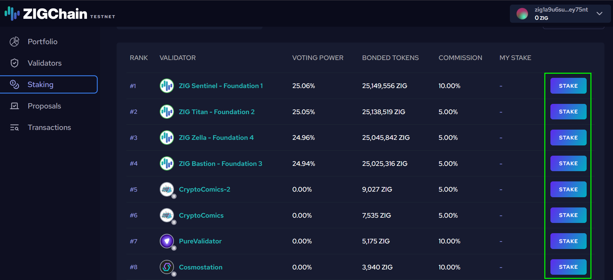

4. In the **Stake to Validator** window:

   - Enter the amount of ZIG you want to stake (or press **MAX** if you want to stake all your available tokens).
   - Review details like available balance, validator commission, and APR.
   - Confirm by clicking **Stake**.

   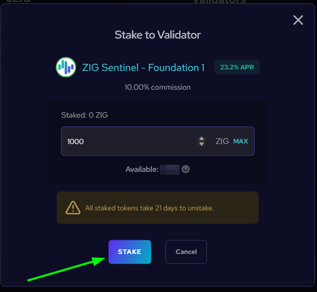

5. Approve the transaction in your wallet.

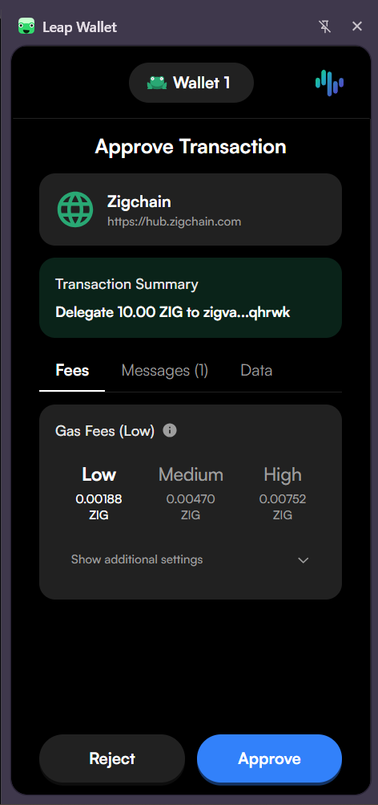

Your staked balance will now appear under **My Validators**.

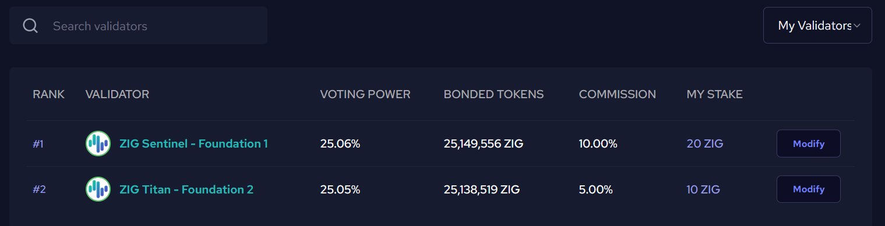

> **Automatic Reward Claiming**  
> If you have unclaimed rewards from a validator and you stake or unstake tokens with that same validator, your rewards will be automatically claimed first. This happens behind the scenes to ensure accurate reward calculations, since your staked amount will change. While this action may not be clearly shown in the transaction summary, you can verify it by checking the event logs of your delegate/undelegate transaction.

## How to Manage Your Stake

Once you’ve staked, the validator row will show a **Modify** button instead of Stake.

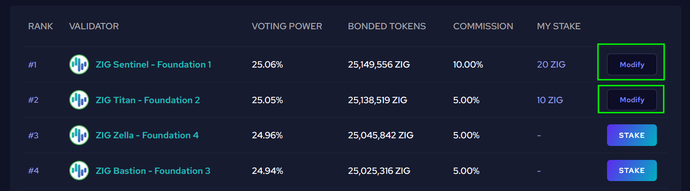

Click **Modify** to open the **Manage Stake** panel, where you can:

- **Stake More**: Add additional tokens to your existing delegation.
- **Unstake**: Withdraw some or all of your tokens (21-day unbonding period applies).
- **Claim Rewards**: Collect your accumulated staking rewards into your wallet.

### How to Unstake

1. Go to the [Staking page](https://hub.zigchain.com/staking).
2. Find your validator under **My Validators**.
3. Click **Modify** → **Unstake**.

   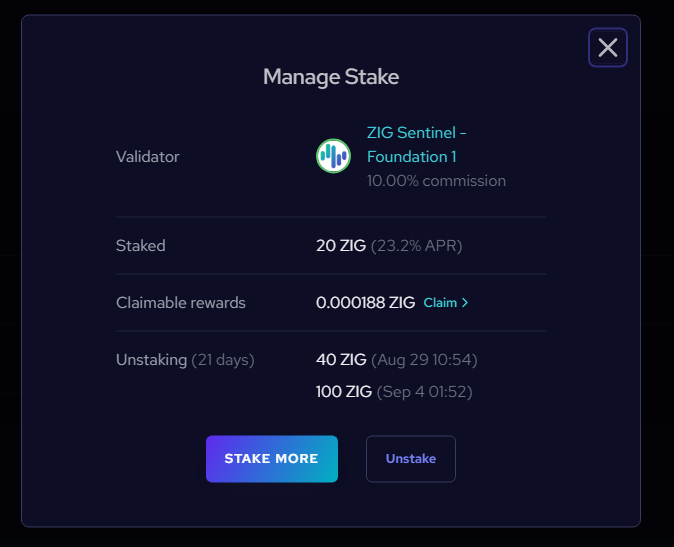

4. Enter the amount you want to undelegate and confirm.

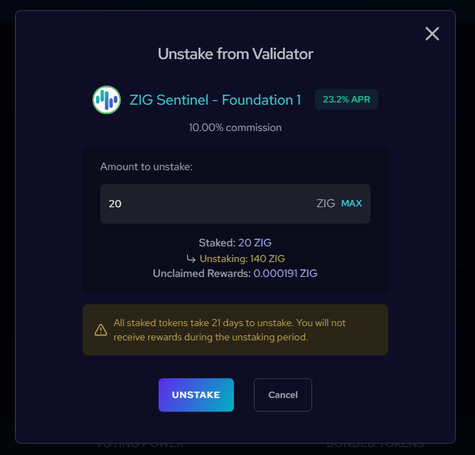

5. Approve the transaction in your wallet.

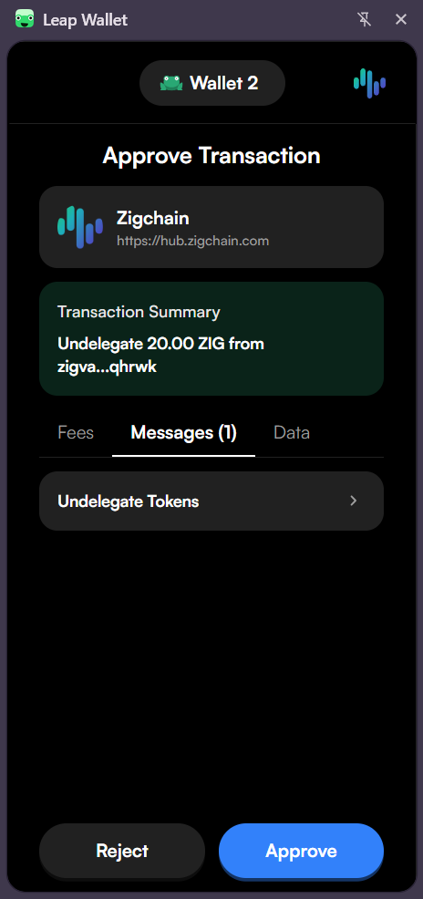

> ⏳ Your tokens will show under **Unstaking**.  
> After the unbonding period (21 days), they will become available in your balance.

> **Note**: If you have unclaimed rewards when you unstake, they will be automatically claimed first before the unstaking occurs. This ensures your rewards are calculated correctly based on your current stake.

### How to Claim Rewards

You have **two ways** to manually claim your rewards:

> **Note**: Rewards are also automatically claimed whenever you stake or unstake tokens from a validator. This happens automatically to keep reward calculations accurate.

**1. Claim All (from Staking Page)**

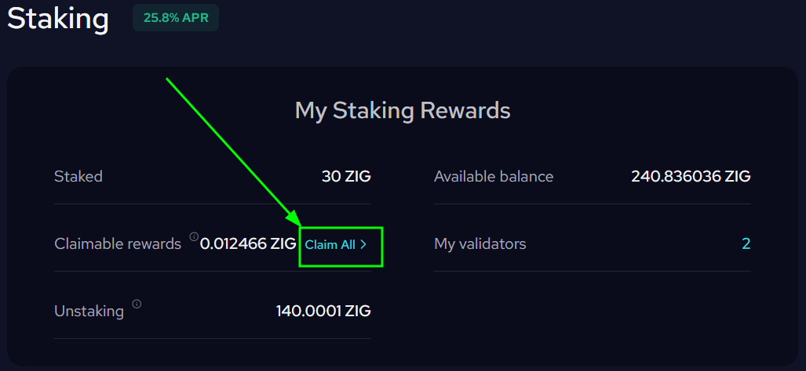

- At the top of the Staking page, under **Claimable Rewards**, click **Claim All**.
- Confirm the transaction in your wallet.

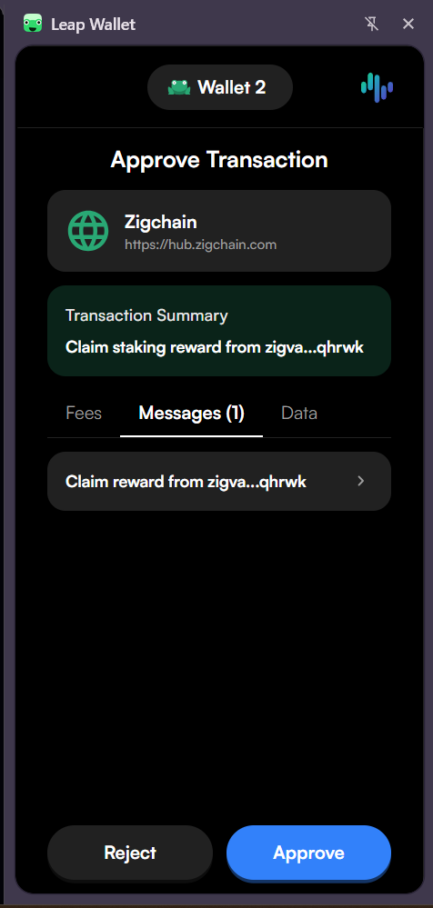

- All available rewards from your validators will be added to your balance.

**2. Claim from Individual Validator**

- Click **Modify** next to a validator.

- In the **Manage Stake** panel, click **Claim** under _Claimable Rewards_.

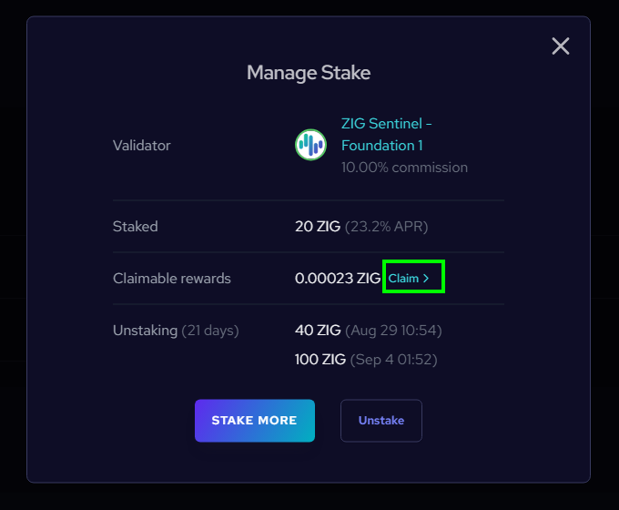

- Confirm the transaction in your wallet.

Start staking now at [ZIGChain HUB](https://hub.zigchain.com/staking).
