# Add ZIGChain to Leap and Keplr Wallets

Here's the step-by-step tutorial guide on how to set up ZIGChain Testnet in your Leap and Keplr wallets.

## How to Add ZIGChain Testnet in Leap Wallet

1. Navigate to [Leap Wallet](https://www.leapwallet.io/download) and install the Leap Wallet extension compatible with your browser.

   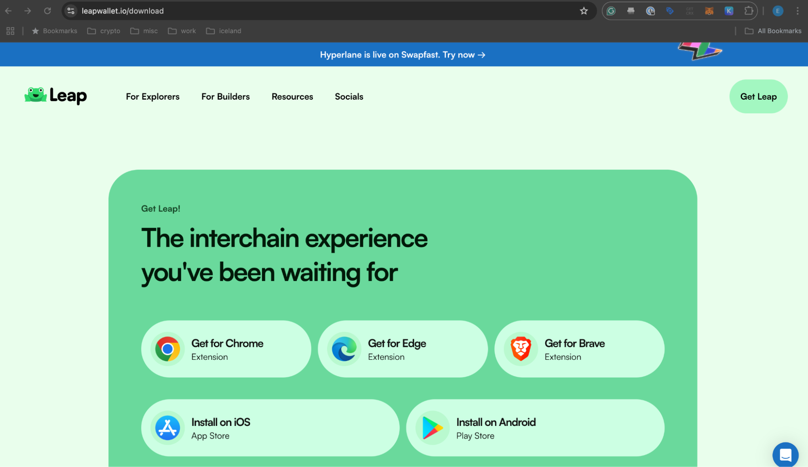

2. Create a new wallet, or import an existing wallet. If you create a new wallet, make sure to write down or securely store the recovery phrase. Make sure to not share your recovery phrase with anyone!

   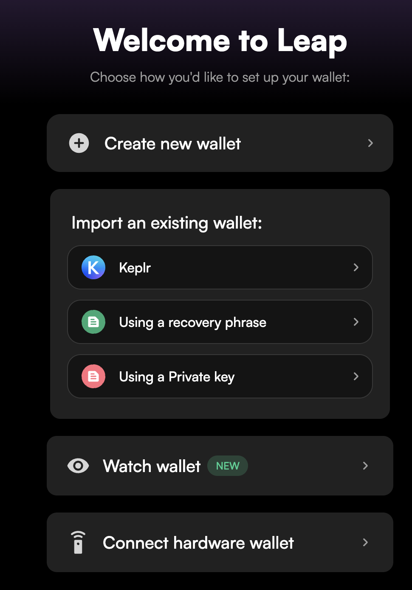

3. Open the Leap extension and click on the **"All Chains"** menu (represented by four squares or the name of your current chain).

   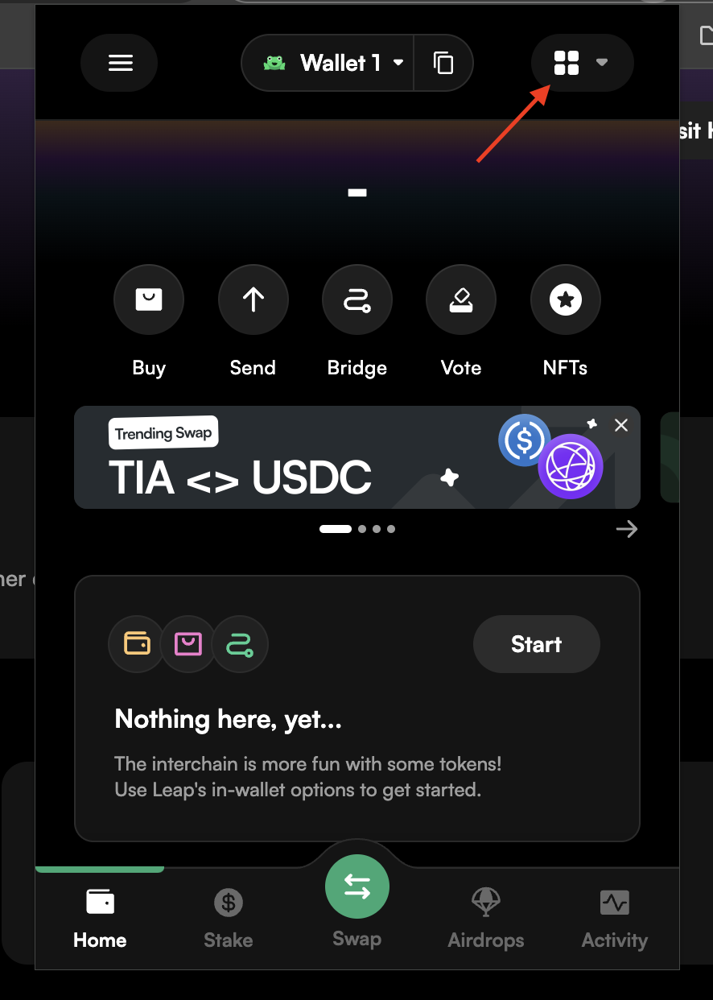

4. Search for **"ZIGChain Testnet"** and favorite it with a star button.

   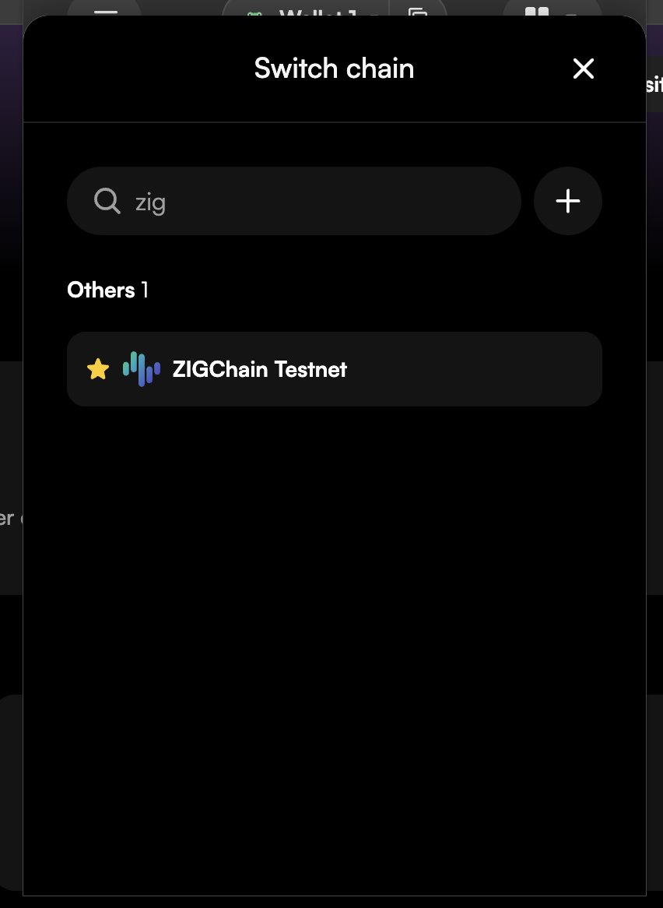

5. Click on "ZIGChain Testnet" to switch to it.

   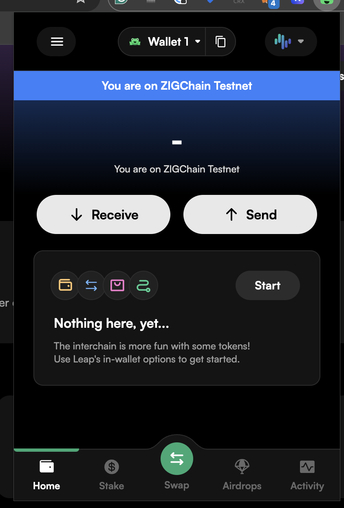

6. In order to receive testnet tokens, click on "Receive" and then copy your wallet address to clipboard.

   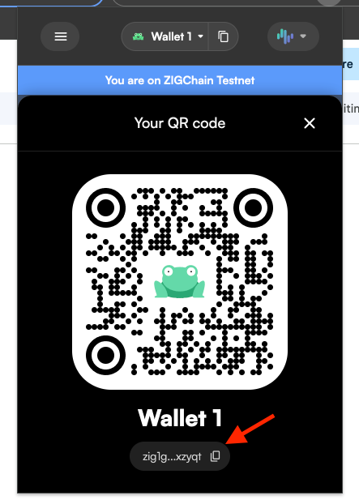

7. Go to [ZIGChain Faucet](https://faucet.zigchain.com/) and click on the CloudFlare challenge.

   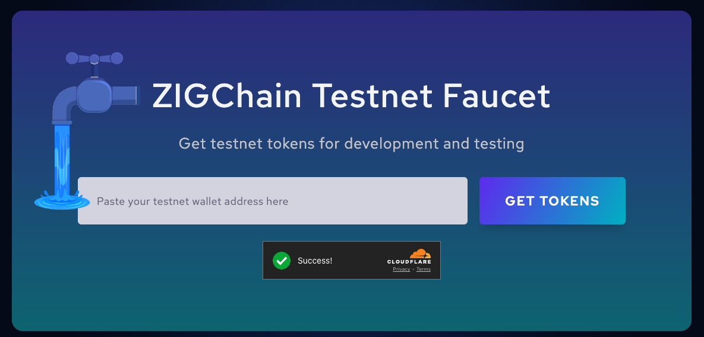

8. Paste your wallet address and click on "Get Tokens" - you should receive test tokens in your wallet shortly. You can get 100 ZIG per wallet address and per IP address per 24 hours.

   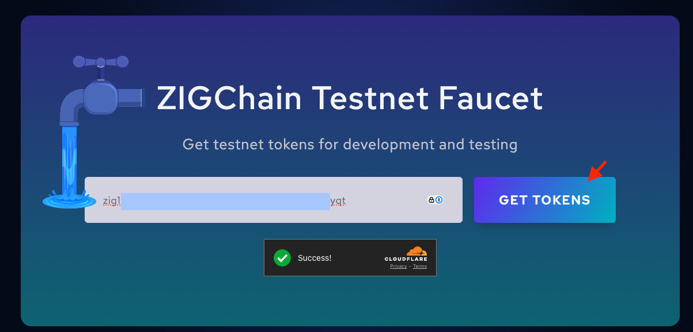

## How to Add ZIGChain Testnet in Keplr Wallet

1. Navigate to [Keplr Wallet](https://www.keplr.app/get) and install the Keplr Wallet extension compatible with your browser.

   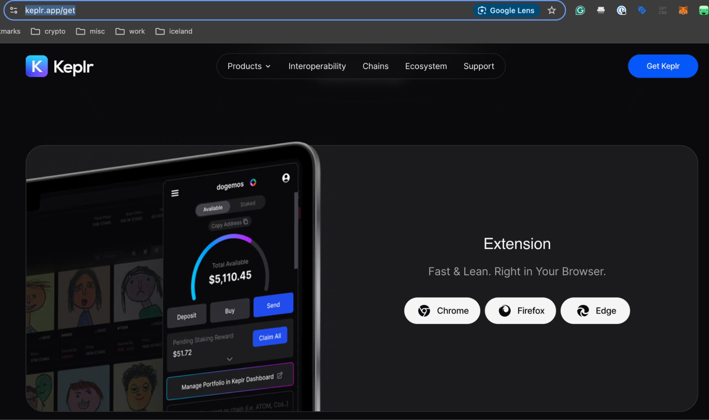

2. Create a new wallet or import an existing wallet. If you create a new wallet, make sure to write down or securely store the recovery phrase. Make sure to not share your recovery phrase with anyone!

   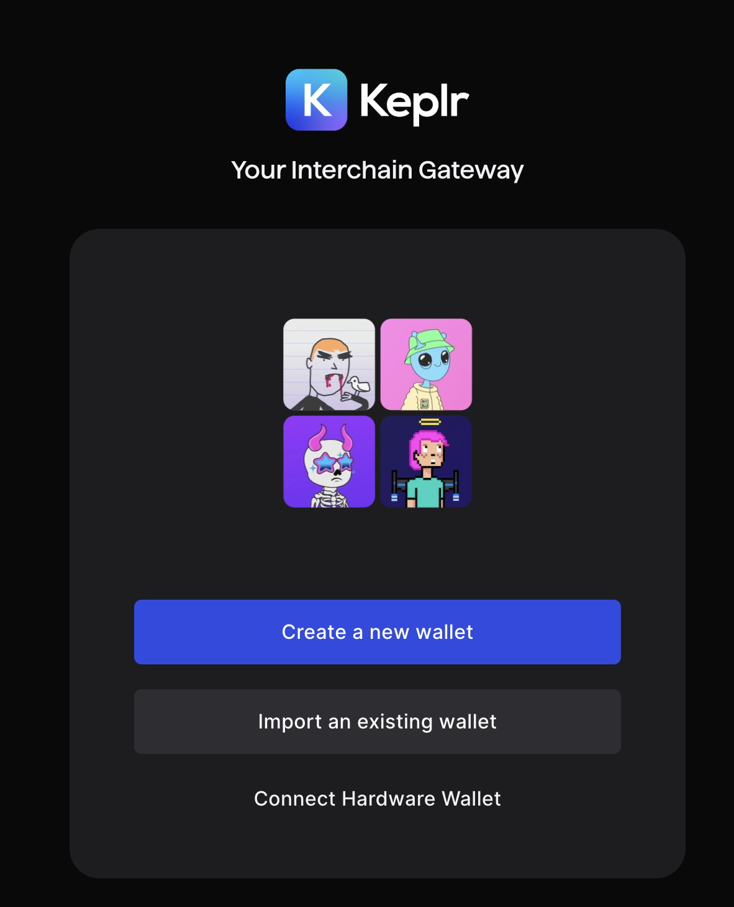

3. To add ZIGChain Testnet, go to [Keplr Chains](https://chains.keplr.app/), search for "ZIGChain Testnet" in the search bar and click on "Add to Keplr >".

   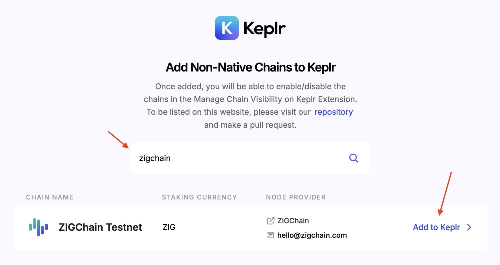

4. Approve the request in the wallet.

   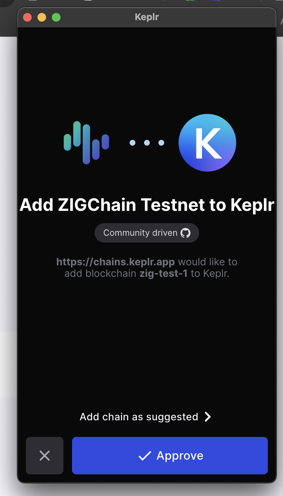

5. In Keplr, click on the hamburger menu and then click **"Manage Chain Visibility."**

   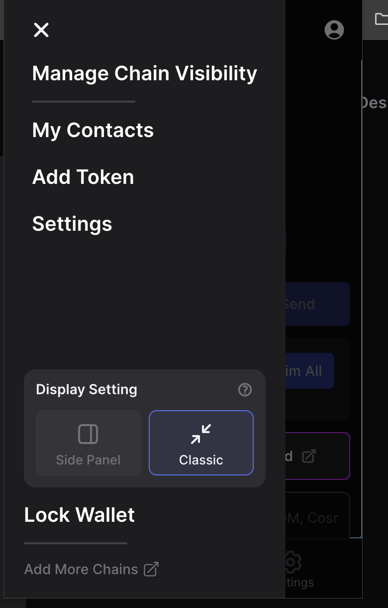

6. Search for **"ZIGChain Testnet"**, enable it, and save.

   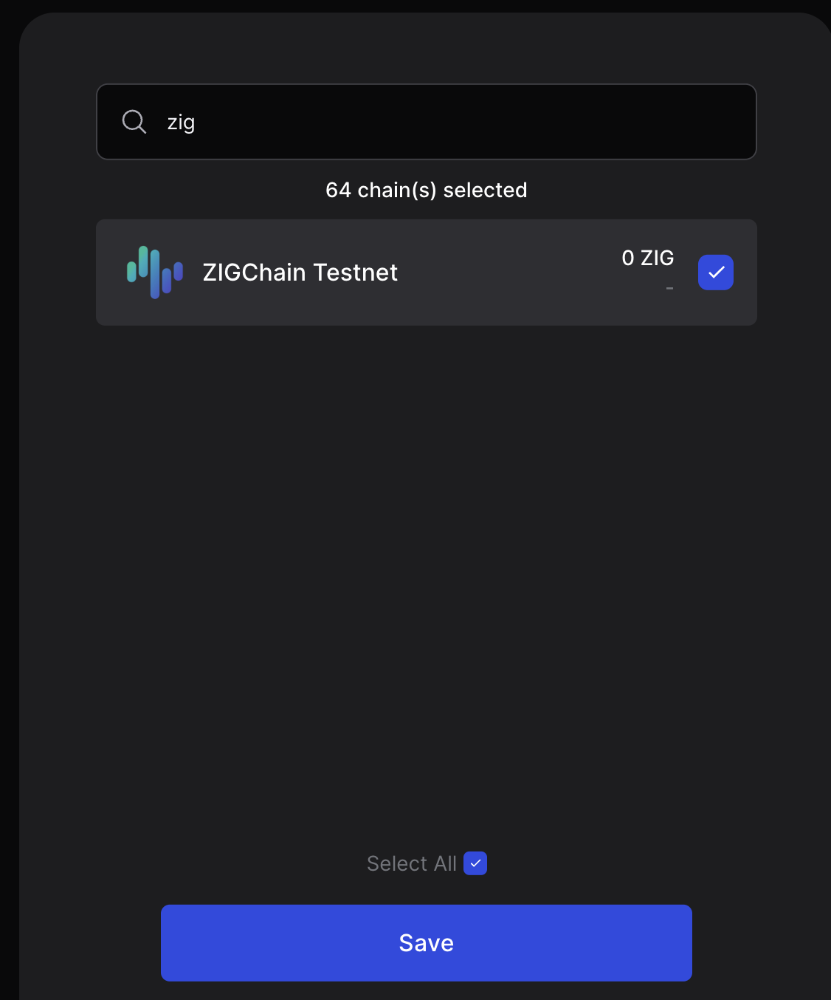
   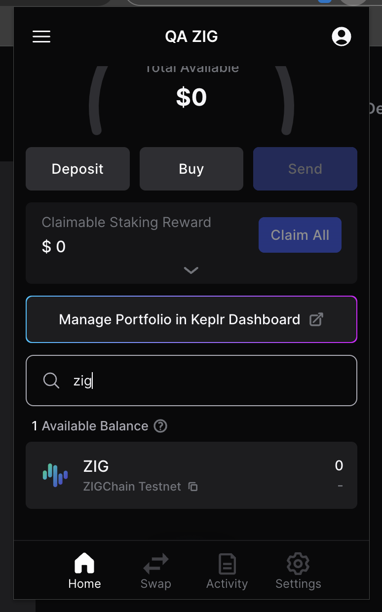

7. In order to receive testnet tokens, click on "ZIG" and then copy your wallet address to clipboard.

   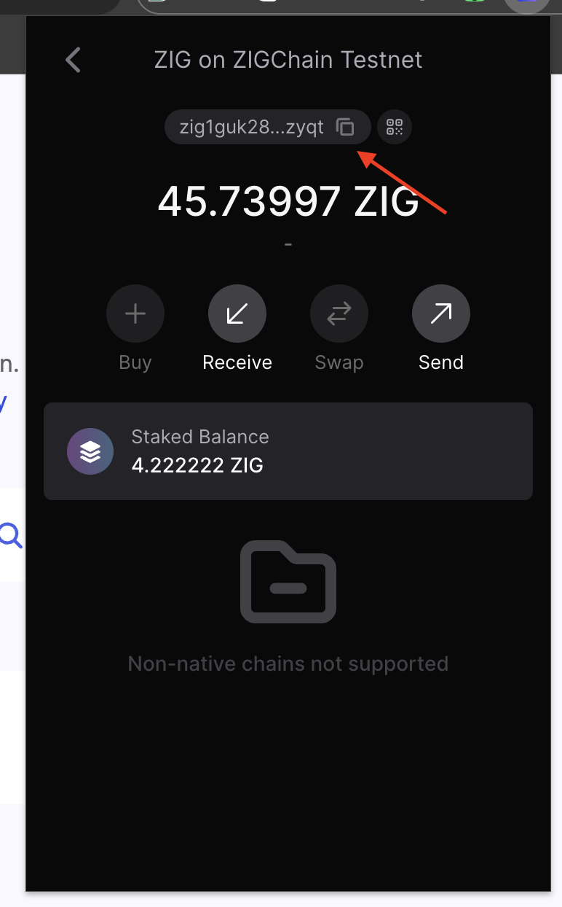

8. Go to [ZIGChain Faucet](https://faucet.zigchain.com/) and click on the CloudFlare challenge.

   

9. Paste your wallet address and click on "Get Tokens" - you should receive test tokens in your wallet shortly. You can get 100 ZIG per wallet address and per IP address per 24 hours.

   

