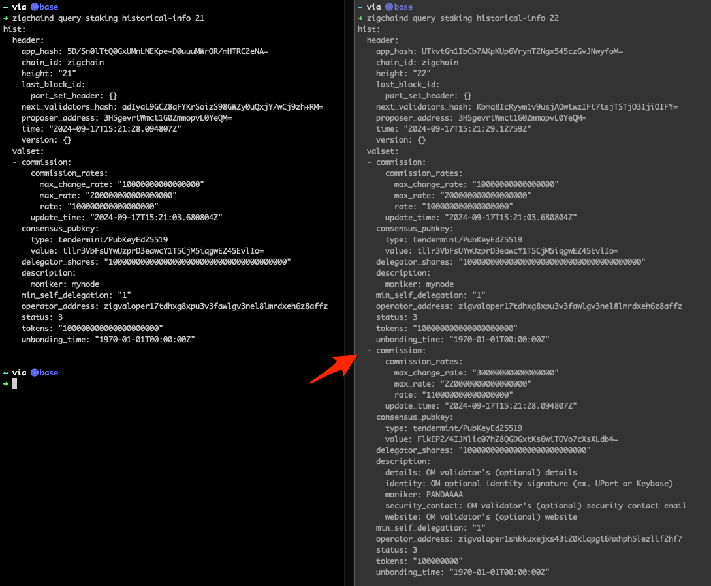
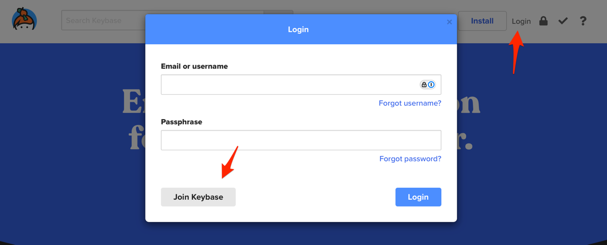
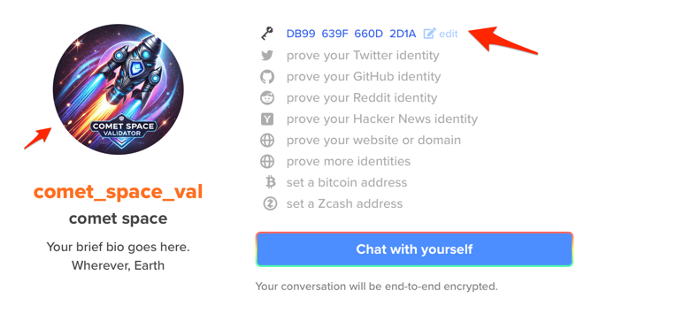

import Tabs from '@theme/Tabs';
import TabItem from '@theme/TabItem';

# Set up a Validator

This guide provides step-by-step instructions for setting up a validator on ZIGChain. It covers prerequisites, key commands, validator parameters, and post-creation validator management.

If you need quick commands for validator creation, refer to the [Validator Quick Sheet](../nodes_validators/validators-quick-sheet.md).

<div class="spacer"></div>

## Validator Requirements

Before creating a validator, ensure you meet the following requirements:

1. **A Running Node**

   - Ensure you have a dedicated node without any other validators operating on it.
   - Follow the [Node Setup Guide](./setup-node.md) if needed.

2. **A ZIGChain Account**

   - The account must not already own a validator.

3. **ZIG Tokens**
   - You will need to self-delegate tokens to your new validator.

<div class="spacer"></div>

## Steps to Create a Validator

### 1\. Get your node validator pubkey

Run the following command to retrieve your **validator's public key**:

```bash
zigchaind tendermint show-validator
```

Example output:

```json
{
  "@type": "/cosmos.crypto.ed25519.PubKey",
  "key": "YYOjubD+2Z5Ytu66JnN0IkJ5BAAApd07Dfj7EF+QQaA="
}
```

Response explanation:

- `@type:` the public key type. It's using the Ed25519 elliptic curve cryptography algorithm.
- `key:` the validator's public key in Base64-encoded format.

### 2\. Define your validator

Create a JSON file containing your **validator information**, including your **node validator public key**.

```bash
PUBKEY=$(zigchaind tendermint show-validator)
bash -c "cat > /tmp/your_validator.txt" << EOM
{
    "pubkey": $PUBKEY,
    "amount": "1000000uzig",
    "moniker": "validator's name",
    "identity": "optional identity signature (ex. UPort or Keybase)",
    "website": "validator's (optional) website",
    "security": "validator's (optional) security contact email",
    "details": "validator's (optional) details",
    "commission-rate": "0.1",
    "commission-max-rate": "0.2",
    "commission-max-change-rate": "0.01",
    "min-self-delegation": "10"
}
EOM
```

❗️Important: `commission-max-rate` and `commission-max-change-rate` can not be changed after the validator is created. Be mindful when setting these values.

Fields explanation:

- `pubkey:` the node validator's public key (get it by running `zigchaind tendermint show-validator)`.
- `amount:` the amount of tokens self-delegated during validator creation(should be greater than the `min-self-delegation`).
- `moniker:` the validator's display name (max. length 70 characters).
- `identity:` an optional field for the validator's identity signature (e.g., UPort or Keybase). It allows you to have a logo on your validator profile. Check [How to add your validator avatar to keybase.io](#how-to-add-your-validator-avatar-to-keybaseio).
- `website:` an optional field for the validator's website (max. length 140 characters).
- `security:` an optional field for the validator's security contact email (max. length 140 characters).
- `details:` an optional field for the additional details about the validator (max. length 280 characters).
- `commission-rate:` the validator's initial commission rate (any number between 0 and `commission-max-rate)`.
- `commission-max-rate:` the validator's maximum commission rate (any number between 0 and 1; not editable after creation).
- `commission-max-change-rate:` the maximum daily validator's commission rate increase (any number between 0 and `commission-max-rate`; not editable after creation).
- `min-self-delegation:` the minimum bonded tokens at all times.

### 3\. Create your validator

Run the following command to create your validator:

<Tabs>
  <TabItem value="Testnet" label="Testnet" default>

```bash
zigchaind tx staking create-validator /tmp/your_validator.txt \
--from=zuser1 \
--chain-id zig-test-2 --node https://public-zigchain-testnet-rpc.numia.xyz \
--gas="auto" \
--gas-prices="0.0025uzig" \
--gas-adjustment=1.5
```

  </TabItem>
  <TabItem value="Local" label="Local">

```bash
zigchaind tx staking create-validator /tmp/your_validator.txt \
--from=zuser1 \
--chain-id zigchain-1 --node http://localhost:26657 \
--gas="auto" \
--gas-prices="0.0025uzig" \
--gas-adjustment=1.5
```

  </TabItem>
</Tabs>

Fields explanation:

- `from`: validator operator managing the validator.
- `chain-id`: the specific chain identifier where the validator will be created (in this case ZIGChain).
- `gas`: automatically estimated the maximum required gas.
- `gas-prices`: your specified transaction gas price.
- `gas-adjustment`: the gas adjustment factor to apply to the gas estimation. While 1.3 is the standard value, we recommend using 1.5 for this operation based on our experience.

Learn more about fees in the [fees article](../general/fees.md).

From the transaction response, you will receive two important pieces of information:

- your **validator operator address**
- **transaction id (txhash)**

Example:

```
"validator_address": "zigvaloper12mhql6ex6c9350m2ectj5zaexldv0v5sa8p37p",
"txhash":"ABC07E49CCE32C69FDE3DC0737142C0FD0BB8C065BA8467507A371E38383C66"
```

The **Validator Operator Address** begins with `zigvaloper1` (for more details check [Validator's Accounts](http://validators_intro.md#validators-accounts)).  
Note: If you don't have the `validator_address`, you can obtain it in the following step.

**Troubleshooting**

- Each validator operator (`--from=zuser1`) can only operate one validator at a time.

Specific error during creation if reused:

`validator already exist for this operator address; must use new validator operator address`

- It is possible to have only one node per node validator's public key.

Specific error during creation if reused:

`validator already exist for this pubkey; must use new validator pubkey`

<div class="spacer"></div>

### 4. Verify validator creation

Check if your validator was successfully created by running the following command. Replace the `TXHASH` with the transaction ID from the previous step.

<Tabs>
  <TabItem value="Testnet" label="Testnet" default>

```bash
TXHASH=ABC07E49CCE32C69FDE3DC0737142C0FD0BB8C065BA8467507A371E38383C66
```

View full transaction log

```bash
zigchaind query tx $TXHASH --chain-id="zig-test-2"
```

View only error info

```bash
zigchaind query tx $TXHASH --chain-id="zig-test-2" | grep raw_log
```

  </TabItem>
  <TabItem value="Local" label="Local">

```bash
TXHASH=ABC07E49CCE32C69FDE3DC0737142C0FD0BB8C065BA8467507A371E38383C66
```

View full transaction log

```bash
zigchaind query tx $TXHASH --chain-id="zigchain-1"
```

View only error info

```bash
zigchaind query tx $TXHASH --chain-id="zigchain-1" | grep raw_log
```

  </TabItem>
</Tabs>

If **raw_log: ""** , the transaction was successful.  
If there is an error it will be shown in the raw_log field.

**Retrieve your validator address:**  
To get the validator address from the response, you can run:

```bash
zigchaind q tx $TXHASH --output json | jq -r '.tx.body.messages[0].validator_address'
```

The response should be: `zigvaloper1...`

### 5. Check if your validator is created:

You can see your validator info by running the following command.  
Replace the `VALIDATOR_OP_ADDRESS` with the validator operator address that you got from the response on step 3\.

```bash
VALIDATOR_OP_ADDRESS=zigvaloper1kzw7uq9u9y37fgf83t26j0cy9rg8dfz2hyg2x5
zigchaind query staking validator $VALIDATOR_OP_ADDRESS
```

Example of a response including all the possible fields:

```
validator:
  commission:
    commission_rates:
      max_change_rate: "30000000000000000"
      max_rate: "220000000000000000"
      rate: "110000000000000000"
    update_time: "2024-09-17T15:08:29.583355Z"
  consensus_pubkey:
    type: tendermint/PubKeyEd25519
    value: FlkEP2/4IJNlic07hZ8QGDGxtKs6wiTOVo7cXsXLdf4=
  delegator_shares: "100000000000000000000000000000000000000"
  description:
    details: validator's (optional) details
    identity: optional identity signature (ex. UPort or Keybase)
    moniker: validator's name
    security_contact: validator's (optional) security contact email
    website: validator's (optional) website
  jailed: true
  min_self_delegation: "1"
  operator_address: zigvaloper1khqz3l8tfaxqau6gsaxdsutyu6g0mg7d7hmel9
  status: 3
  tokens: "100000000000000000000"
  unbonding_height: "408"
  unbonding_ids:
  - "1"
  unbonding_time: "2024-09-17T15:08:29.583355Z"
```

Note: Take into account that most of the numbers are multiplied by 10^18.

Fields explanation:

- `max_change_rate:` the validator's max_change_rate (provided in the create-validator transaction)
- `max_rate:` the validator's max_rate (provided in the create-validator transaction)
- `rate`: the validator's commission rate (provided in the create-validator transaction)
- `update_time`: the time since the last commission update.
- `consensus_pubkey`: the validator's public key.
- `delegator_shares:` the total amount of tokens delegated to the validator multiplied by 10^18.
- `description:` the validator's information.
- `jailed:` the validator's status (if true, the validator is jailed).
- `min_self_delegation:` the minimum bonded tokens at all times
- `operator_address:` the validator's operator address,generated during creation.
- `status:` the validator's status (0: Unspecified, 1: Unbonded, 2: Unbonding, 3: Bonded; for more details check [Validators Statuses](../nodes_validators/validators-faq.md#validator-statuses)).
- `tokens:` the amount of tokens held by the validator.
- `unbonding_height:` the height where the unbonding happened.
- `unbonding_ids:` the id of the unbonding, which can include multiple instances and validator jailing events.
- `unbonding_time:` when the unbonding will finish.

### 6\. Check if your validator is in the active set

You can check if your validator is in the active set by running:

```bash
zigchaind query tendermint-validator-set | grep "$(zigchaind tendermint show-address)"
```

Response output example:

```
block_height: "182"
pagination:
  next_key: null
  total: "2"
validators:
- address: zigvalcons1raz54tdwlsg3lfx45l57emvd0mnhshmfsspe4a
  proposer_priority: "494"
  pub_key:
    '@type': /cosmos.crypto.ed25519.PubKey
    key: FQIAIKv1pNhe5uzg8OOI4AF+cHZY/QruQha2LlBaELA=
  voting_power: "1000"
- address: zigvalcons1ws6z6vrdgjm33t9qvukqjd7cmh5kew6xsyc0qm
  proposer_priority: "-494"
  pub_key:
    '@type': /cosmos.crypto.ed25519.PubKey
    key: FQIAIKv1pNhe5uzg8OOI4AF+cHZY/QruQha2LlBaEEE=
  voting_power: "1"
```

Fields explanation:

- `block_height:` the blockchain height at which the validator joined the active set.
- `address:` the validator's consensus address.
- `proposer_priority:` the validator's priority to propose a block.
- `pub_key:` the validator's public key.
- `voting_power:` the validator's voting power in the active set.

### Check Validator Creation Height Block Info

The block height at which your validator was created (e.g. height 1000) can be verified. Using the staking historical-info query, you'll notice that your validator does not appear at the exact creation height but in the following block (e.g. height 1001).

```bash
zigchaind query staking historical-info
```

Here's an example:



### How to add your validator avatar to keybase.io

1. Visit [keybase.io](https://keybase.io)

2. Click on the Login button and then the Join Keybase button



3. Create a new account (enter your email, username, and password). The username will be used to create your profile URL.

4. Add a logo to your profile

5. Create a PGP key or add your existing key

6. Add the key to your Validator Identity Key



## Manage your Validator

As a validator, you can perform several management tasks, including:

- Updating validator information,
- Checking jail status,
- Unjailing validators,
- Withdrawing earned commissions.

### Retrieve your validator addresses

Run the following command to retrieve your validator operator address (zigvaloper1...):

```bash
zigchaind query staking validator
```

Run the following command to retrieve your validator consensus address (zigvalcons1...):

```bash
zigchaind comet show-address
zigchaind query slashing signing-info $(zigchaind tendermint show-validator) --chain-id=zigchain
```

### Check if your validator is in the active set

To check if your validator is in the active set, run the following command:

```bash
zigchaind query staking validators | grep -A 2 $(zigchaind tendermint show-validator)
```

### Update your validator information

Update your validator information by running the following command:

<Tabs>
  <TabItem value="Testnet" label="Testnet" default>
    ```bash
    zigchaind tx staking edit-validator \
      --commission-rate 0.05 \
      --details "YOUR_DETAILS" \
      --identity "YOUR_KEYBASE_ID" \
      --min-self-delegation "100" \
      --new-moniker "Your new moniker name" \
      --website "YOUR_WEBSITE_URL" \
      --security-contact "YOUR_EMAIL" \
      --chain-id zig-test-2 \
      --from zuser1 \
      --gas-adjustment 1.5 \
      --gas auto \
      --gas-prices="0.0025uzig"
    ```
  </TabItem>
  <TabItem value="Local" label="Local">
    ```bash
    zigchaind tx staking edit-validator \
      --commission-rate 0.05 \
      --details "YOUR_DETAILS" \
      --identity "YOUR_KEYBASE_ID" \
      --min-self-delegation "100" \
      --new-moniker "Your new moniker name" \
      --website "YOUR_WEBSITE_URL" \
      --security-contact "YOUR_EMAIL" \
      --chain-id zigchain-1 \
      --from zuser1 \
      --gas-adjustment 1.5 \
      --gas auto \
      --gas-prices="0.0025uzig"
    ```
  </TabItem>
</Tabs>

Fields explanation:

- `commission-rate:` the validator's initial commission rate (any number between 0 and `commission-max-rate)`.
- `details:` an optional field for the additional validator's details (max. length 280 characters).
- `identity:` an optional field for the validator's identity signature (e.g., UPort or Keybase). It allows you to have a logo on your validator profile. To do it check [How to add your validator avatar to keybase.io](#how-to-add-your-validator-avatar-to-keybaseio).
- `min-self-delegation:` the minimum amount of bonded tokens required.
- `new-moniker:` the validator's display name (max. length 70 characters).
- `website:` an optional field for the validator's website (max. length 140 characters).
- `security-contact:` an optional field for the validator's security contact email (max. length 140 characters).

❗️ About commission-rate:

- You can not change `commission-max-change-rate` more than once in 24h (including Validator's creation).  
  If you try to, it triggers the following error:

```
Error Example: "rpc error: code = Unknown desc = rpc error: code = Unknown desc = failed to execute message; message index: 0: commission cannot be changed more than once in 24h [cosmos/cosmos-sdk@v0.50.4/baseapp/baseapp.go:1000] with gas used: '36017': unknown request"
```

- `commission-rate` must be between 0 and the validator's `commission-max-rate` It must not exceed the validator's `commission-max-change-rate,` which limits the percentage point increase per day. In other words, a validator can only change its commission once per day and within commission-max-change-rate bounds.

### Check rewards earned by a validator

To check validator commission rewards, run the following command:

```bash
VALIDATOR_OP_ADDRESS=zigvaloper1kzw7uq9u9y37fgf83t26j0cy9rg8dfz2hyg2x5
zigchaind query distribution commission $VALIDATOR_OP_ADDRESS
```

Response example:

```
commission:
  commission:
  - amount: "2704918545530833605106000000000000000"
    denom: uzig
```

To check the distribution outstanding (un-withdrawn) validator rewards, including the self-bonded rewards, run:

```bash
VALIDATOR_OP_ADDRESS=zigvaloper1kzw7uq9u9y37fgf83t26j0cy9rg8dfz2hyg2x5
zigchaind query distribution validator-distribution-info $VALIDATOR_OP_ADDRESS
```

Response:

```
commission:
- amount: "38375879093711570202393995300207049"
  denom: uzig
operator_address: zig1dpl7jfuw6t5g7hnryhkeecard2wkjpdscdpmph
self_bond_rewards:
- amount: "345382911843404131821248564921305348"
  denom: uzig
```

### Withdraw Validator Commissions

To withdraw earned commissions, run the following command:

<Tabs>
  <TabItem value="Testnet" label="Testnet" default>
    ```bash
    VALIDATOR_OP_ADDRESS=zigvaloper1kzw7uq9u9y37fgf83t26j0cy9rg8dfz2hyg2x5
    zigchaind tx distribution withdraw-rewards $VALIDATOR_OP_ADDRESS \
      --chain-id zig-test-2 \
      --from z \
      --gas-adjustment 1.5 \
      --gas auto \
      --gas-prices="0.0025uzig"
    ```
  </TabItem>
  <TabItem value="Local" label="Local">
    ```bash
    VALIDATOR_OP_ADDRESS=zigvaloper1kzw7uq9u9y37fgf83t26j0cy9rg8dfz2hyg2x5
    zigchaind tx distribution withdraw-rewards $VALIDATOR_OP_ADDRESS \
      --chain-id zigchain-1 \
      --from z \
      --gas-adjustment 1.5 \
      --gas auto \
      --gas-prices="0.0025uzig"
    ```
  </TabItem>
</Tabs>

### Validator Slashing Information

There are two types of slashing:

1. **Down-time slashing:** If a validator misses blocks, it gets slashed.
2. **Double-sign slashing:** If a validator signs two blocks at the same height, it gets slashed.

When a validator is slashed two things happen:

1. A portion of its **stake is burned** permanently.
2. The validator is jailed and can not participate in the consensus process until the jail period ends.

Slashing formula:  
The amount of slashing is calculated with the following formula:

```
Amount of slashing = slashFactor * power at time of infraction
```

#### Check If a Validator Is Jailed

To know how a validator is doing in terms of signing blocks, you can check the signing info. If the validator is not signing blocks, they will be jailed. You can check the signing info by running:

<Tabs>
  <TabItem value="Testnet" label="Testnet" default>
    ```bash
    zigchaind query slashing signing-info $(zigchaind tendermint show-validator) --chain-id=zig-test-2
    ```
  </TabItem>
  <TabItem value="Local" label="Local">
    ```bash
    zigchaind query slashing signing-info $(zigchaind tendermint show-validator) --chain-id=zigchain-1
    ```
  </TabItem>
</Tabs>

Response example:

```
info:
- address: zigvalcons1w668krhqvz0ny0y752hcu7me35gnuj22hns33n
index_offset: "28"
jailed_until: "2024-09-17T15:33:12.248209Z"
missed_blocks_counter: "28"
start_height: "3141"

- address: zigvalcons1m3lxq7h6a4dxwtw5d5ve563fhj73s7grljyqf4
index_offset: "3170"
jailed_until: "1970-01-01T00:00:00Z"
pagination:
total: "2"
```

Parameters explanation:

- `address:` the validator's consensus address.
- `index_offset:` the index which is incremented each time that the validator has been bonded.
- `jailed_until:` the timestamp when the validator can be unjailed.
- `missed_blocks_counter:` a counter kept to avoid unnecessary array reads.
- `start_height:` the height at which the validator was first a candidate OR was unjailed.
- `tombstoned:` whether a validator has been tombstoned (permanently removed from the set). Only appears if true.
- `pagination.total:` is the total number of validators.

#### Get Slashes Amount Information

To get the slashes information of a validator, run the following command:

```bash
VALIDATOR_OP_ADDRESS=zigvaloper1w4n0c8tttcvxp7drcw5la7nxh0ezmnyj6ttvgl
zigchaind query distribution slashes $VALIDATOR_OP_ADDRESS 0 2000
```

Where 0 and 2000 are the starting and ending height of the query. You can change them to get the information you need.

If your validator has never been slashed you will get a null response. Otherwise, you will get the list of slashes:

```
pagination:
  total: "1"
slashes:
- fraction: "10000000000000000"
  validator_period: "2"
- fraction: "9090909090909091"
  validator_period: "3"
```

Parameters explanation:

- `fraction:` the percentage of the validator's stake that was slashed multiplied by 10^18
- `validator_period:` the period in which the slashing occurred. It can be incremented due to slashing events or rewards payouts.

### Unjail your Validator

If your validator gets slashed, it will show `jailed: true` in the validator information. Check if your validator is jailed by running:

```bash
VALIDATOR_OP_ADDRESS=zigvaloper1kzw7uq9u9y37fgf83t26j0cy9rg8dfz2hyg2x5
zigchaind query staking validator $VALIDATOR_OP_ADDRESS
```

To unjail your validator, you need to wait for the jail period to end. To know when your jailing period ends, run:

```bash
VALIDATOR_CON_ADDRESS=zigvalcons1hxdqftn7kw8d0xe7sq2xysr6mk6qfjl72x729f
zigchaind query slashing signing-info $VALIDATOR_CON_ADDRESS --chain-id=zigchain
zigchaind query slashing signing-info $(zigchaind tendermint show-validator) --chain-id=zigchain
```

Once the jail period ends, you can unjail your validator by running:

<Tabs>
  <TabItem value="Testnet" label="Testnet" default>
    ```bash
    zigchaind tx slashing unjail \
      --chain-id="zig-test-2" \
      --gas="auto" \
      --gas-prices="0.0025uzig" \
      --from=zuser1 \
      --gas-adjustment=1.5
    ```
  </TabItem>
  <TabItem value="Local" label="Local">
    ```bash
    zigchaind tx slashing unjail \
      --chain-id="zigchain-1" \
      --gas="auto" \
      --gas-prices="0.0025uzig" \
      --from=zuser1 \
      --gas-adjustment=1.5
    ```
  </TabItem>
</Tabs>

❗ After unjail, if your validator has enough stake to rank within the top validators, it will automatically be **re-bonded**.  
All **delegators** who were previously bonded to this validator will **resume earning rewards**.

If you try to unjail before the jail period ends, you will get the following error:

```
validator still jailed; cannot be unjailed
```

Check when your jail period ends by running:

```bash
VALIDATOR_CON_ADDRESS=zigvalcons1hxdqftn7kw8d0xe7sq2xysr6mk6qfjl72x729f
zigchaind query slashing signing-info $VALIDATOR_CON_ADDRESS
zigchaind query slashing signing-info $(zigchaind tendermint show-validator) --chain-id=zigchain
```

## References

- [ZIGChain - Validator Quick Sheet](../nodes_validators/validators-quick-sheet.md)

- [Validators Statuses Codes](https://github.com/cosmos/cosmos-sdk/blob/main/x/staking/types/staking.pb.go)

- [Maximum Fields Lengths](https://github.com/cosmos/cosmos-sdk/blob/main/x/staking/types/validator.go)

- [Cosmos SDK - Staking Module](https://docs.cosmos.network/main/build/modules/staking)

- [Cosmos SDK - Slashing Module](https://docs.cosmos.network/main/build/modules/slashing)

- [Cosmos SDK - Distribution Module](https://docs.cosmos.network/main/build/modules/distribution)
