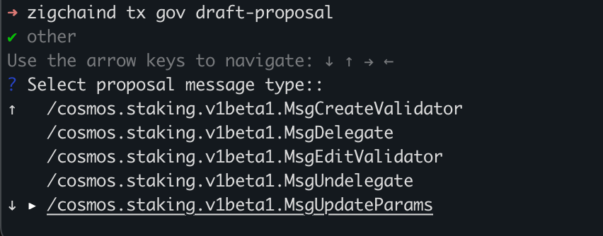
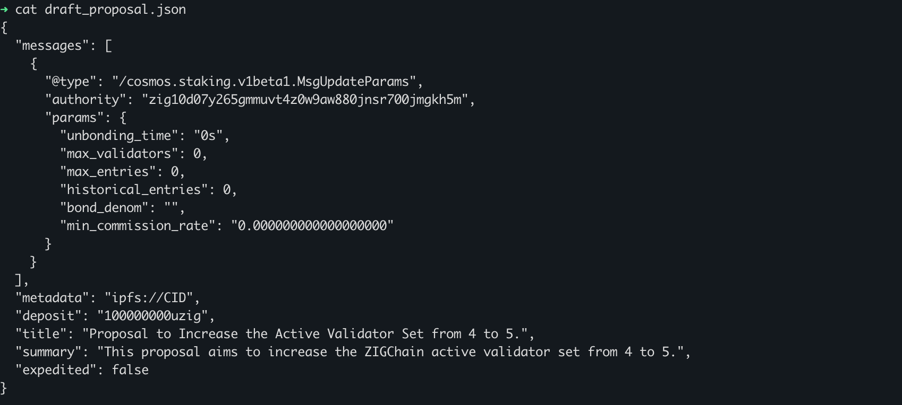
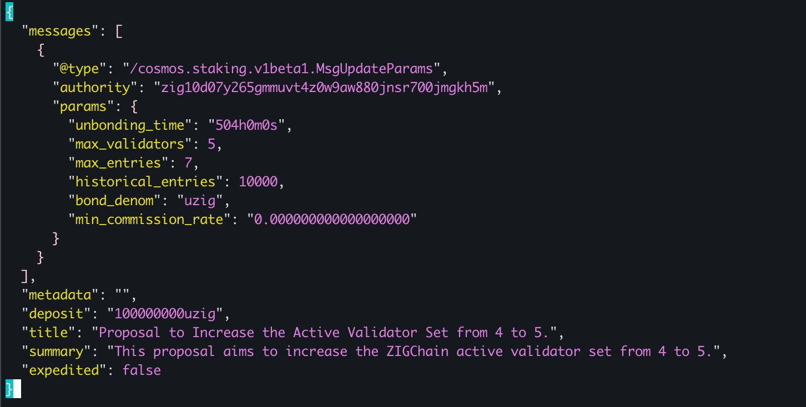
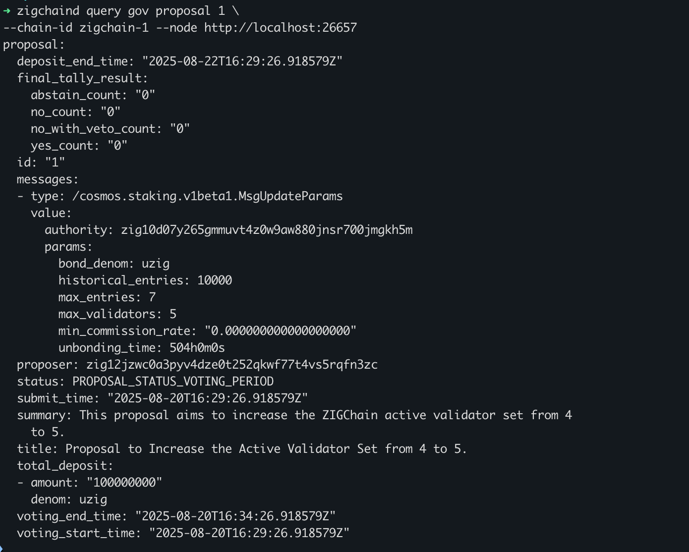

import Tabs from '@theme/Tabs';
import TabItem from '@theme/TabItem';

# ZIGChain Proposal Submission Guide

ZIGChain governance is the backbone of the network’s decentralized decision-making. Through governance, ZIG holders who 
have staked their tokens with active validators can influence the future of the protocol — 
from adjusting key parameters to deciding how community funds are allocated.

If you’re new to governance, we recommend first reading the [Governance](../governance) 
documentation for better understanding of the proposal lifecycle and components, voting rules, and special cases. 

Once you’re familiar with the concepts, this guide will help you take the next step: actually creating and submitting a 
proposal on-chain.

In this guide, we focus on the practical side of governance — walking through each step from drafting a proposal to 
submitting it on-chain. By the end, you’ll know how to transform an idea into a formal proposal ready for the community 
to review and vote on.

<div class="spacer"></div>

## Detailed Steps for Submitting a Proposal

### 1️⃣ Draft a Proposal

To draft a proposal, follow these steps:

**1.1 Run the Draft Command**  

Use the following command to start the proposal draft process:

```sh
zigchaind tx gov draft-proposal
```

---
**1.2 Select Proposal Type**  

You’ll be prompted to select the type of proposal. The interface displays common options such as:

```
? Select proposal type:
  ▸ text
    community-pool-spend
    software-upgrade
    cancel-software-upgrade
    other
```

Output example:


If the type of proposal you need is not listed (for example, if you are modifying module parameters), select `other`. 
This will display all supported message types accepted by the governance module, such as:

```
? Select proposal message type:
  ▸ /cosmos.auth.v1beta1.MsgUpdateParams
    /cosmos.bank.v1beta1.MsgSend
    /cosmos.distribution.v1beta1.MsgSetWithdrawAddress
```

Output example:



**Tip**: Use the arrow keys to navigate and **Enter** to select.

---
**1.3 Provide Metadata**  
After selecting, you'll be asked to fill in the required fields, such as:
- Title
- Summary 
- Description 
- Other fields (As requested by the interface.)

Output example:


---
**1.4 Review the Generated Files**  

After completing the prompts, two files will be created:
* `draft_proposal.json`: Contains the actual message(s) to be executed if the proposal passes.
* `draft_metadata.json`: Contains a human-readable summary including title, description, summary.

Output examples:

    - `draft_proposal.json`



    - `draft_metadata.json`


<div class="spacer"></div>

### 2️⃣ Update Metadata Field

The `draft_proposal.json` must include a reference to the metadata. This link is not added automatically, so you need 
to set it manually. There are several ways to do this:

* **Inline raw metadata** – insert the contents of `draft_metadata.json` directly into the `metadata` field.
* **Base64-encoded string** – encode the file contents in base64 and paste the result into the field.
* **IPFS reference** – upload the metadata file to IPFS and set the `metadata` field to the IPFS URI.

> ⚠️ The `metadata` field must be a JSON-encoded string and is limited to **255 characters**.

<div class="spacer"></div>

### 3️⃣ Configure Authority Field (If Required)

Certain proposal types, especially those altering module parameters, require an `authority` field.
This must match the address of the governance module account.

The default governance module account address is: 
```
zig10d07y265gmmuvt4z0w9aw880jnsr700jmgkh5m
```

<div class="spacer"></div>

### 4️⃣ Making Updates Before Submission (If Necessary)  

#### Updating Module Parameters

When proposing parameter changes, you must prepare the `draft_proposal.json` carefully.

> ⚠️ **Important:** Always include the full set of current parameters. Only change the values you intend to update, and 
leave all others exactly as they are.
If you omit or leave parameters empty, they may be overwritten with empty values when the proposal is executed.

**1. Check Current Parameters**   

Query the module to retrieve its current parameters before editing.

Example:

<Tabs>
  <TabItem value="Testnet" label="Testnet" default>

```sh
zigchaind query staking params \
--chain-id zig-test-2 --node https://public-zigchain-testnet-rpc.numia.xyz 
```
  </TabItem>
  <TabItem value="Local" label="Local">

```sh
zigchaind query staking params \
--chain-id zigchain-1 --node http://localhost:26657
```
  </TabItem>
</Tabs>

Output example:


<br />

**2. Update the Proposal File** 

Open `draft_proposal.json` and paste the full parameter set from the query output.  

Modify **only** the values you want to change, ensuring all other parameters remain unchanged.

```sh
vim draft_proposal.json
```

Output example:



<div class="spacer"></div>

#### Expedited Proposals

To mark a proposal as expedited, set the expedited field to true:

```sh
jq '.expedited = true' draft_proposal.json > tmp.json && mv tmp.json draft_proposal.json
```

For more details, see the [Governance documentation](../governance#expedited-proposals)

<div class="spacer"></div>

### 5️⃣ Submit the Proposal

Once your proposal is ready, use the following command to submit it:

<Tabs>
  <TabItem value="Testnet" label="Testnet" default>

```sh
zigchaind tx gov submit-proposal draft_proposal.json \
  --from $ACCOUNT \
  --chain-id zig-test-2 \
  --node https://public-zigchain-testnet-rpc.numia.xyz \
  --gas-prices 0.0025uzig \
  --gas auto \
  --gas-adjustment 1.3
```
  </TabItem>
  <TabItem value="Local" label="Local">

```sh
zigchaind tx gov submit-proposal draft_proposal.json \
  --from zuser1 \
  --chain-id zigchain-1 \
  --node http://localhost:26657 \
  --gas-prices 0.0025uzig \
  --gas auto \
  --gas-adjustment 1.3
```
  </TabItem>

</Tabs>

Output example:


If you see the error:

```
expected gov account as only signer for proposal message
```

It means that the `authority` in your proposal doesn't match the actual governance module account. Double-check the value and try again.

<div class="spacer"></div>

### 5️⃣ Confirm Proposal Creation

Once submitted, retrieve your proposal id:

<Tabs>
  <TabItem value="Testnet" label="Testnet" default>

```sh
zigchaind query gov proposals \
--chain-id zig-test-2 --node https://public-zigchain-testnet-rpc.numia.xyz 
```
  </TabItem>
  <TabItem value="Local" label="Local">

```sh
zigchaind query gov proposals \
--chain-id zigchain-1 --node http://localhost:26657
```
  </TabItem>
</Tabs>

Or fetch a specific one:  

<Tabs>
  <TabItem value="Testnet" label="Testnet" default>

```sh
zigchaind query gov proposal $PROPOSAL_ID \
--chain-id zig-test-2 --node https://public-zigchain-testnet-rpc.numia.xyz 
```
  </TabItem>
  <TabItem value="Local" label="Local">

```sh
zigchaind query gov proposal $PROPOSAL_ID \
--chain-id zigchain-1 --node http://localhost:26657
```
  </TabItem>
</Tabs>

This confirms your proposal was registered on-chain.

Output example:



<div class="spacer"></div>

## References

* [Governance](../governance)
* [Governance CLI Quick Sheet](../../build/governance-module#governance-cli-quick-sheet)
* [Cosmos SDK Governance Module](https://docs.cosmos.network/main/build/modules/gov)

