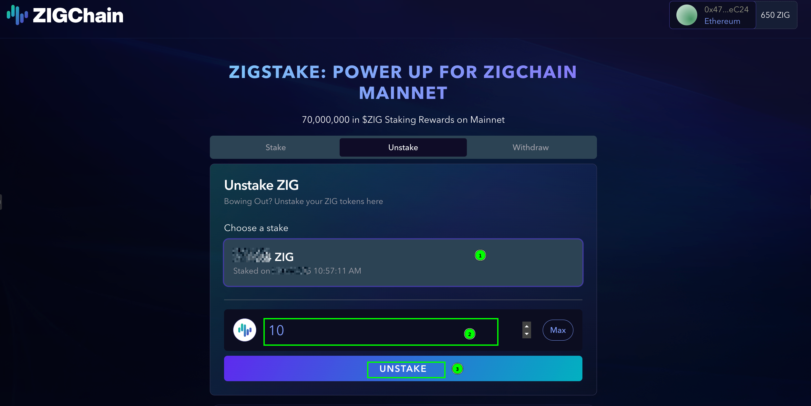

# How to Unstake from Old Staking Program

**Ready to unlock the full potential of your ZIG tokens?** The future of ZIGChain is here, and it's time to migrate your tokens to the mainnet where you can access DeFi protocols, participate in governance, and continue earning rewards with enhanced benefits!

This guide will walk you through unstaking from the old program at [https://staking.zigchain.com/](https://staking.zigchain.com/) and migrating to ZIGChain mainnet.

> **Important**: The old staking program has completed, and there is **no longer an unbonding period**. Once you unstake, your tokens will be immediately available in your wallet.

---

## Step-by-Step Unstaking Process

### 1. Connect Your Wallet

1. Visit [https://staking.zigchain.com/](https://staking.zigchain.com/)
2. Click **"CONNECT YOUR WALLET"** button
3. Select and connect the wallet you used for the original staking program
4. Ensure you're connected to the correct network (Ethereum or BSC, depending on where you originally staked)

### 2. Navigate to Unstake Tab

1. Once connected, you'll see the main interface with three tabs: **"Stake"**, **"Unstake"**, and **"Withdraw"**
2. Click on the **"Unstake"** tab to access the unstaking interface
3. You'll see the "Unstake ZIG" section with the message "Bowing Out? Unstake your ZIG tokens here."

### 3. Enter Unstake Amount

1. Click on the **"Choose a stake"** section to expand the unstaking interface
2. Enter the amount of ZIG tokens you want to unstake, or click **"MAX"** to unstake all available tokens
3. Click the **"Unstake"** button to proceed

### 4. Confirm Unstake Transaction

1. A confirmation popup will appear asking you to review the unstaking details
2. Click the **"Continue"** button to approve the unstake request

3. You will see a notification prompting you to sign the transaction to complete the unstake process

4. Your wallet interface will open - review the transaction details and approve the unstake transaction

5. **Important**: Since the staking program has completed, there is **no unbonding period** - your tokens will be immediately available in your wallet after the transaction is confirmed

### 5. Verify Token Availability

1. Check your wallet balance to confirm the ZIG tokens have been returned
2. The tokens should now be available as either ERC-20 (if staked on Ethereum) or BEP-20 (if staked on BSC) tokens

---

## Next Steps: Bridge to ZIGChain

After successfully unstaking your tokens, you can now migrate them to ZIGChain mainnet. The migration process depends on which network your tokens are on:

### For Ethereum (ERC-20) Tokens:

- Follow the [ZIG Bridge guide](../zigchain_hub/bridge.md) to bridge directly from Ethereum to ZIGChain using Axelar

### For BSC (BEP-20) Tokens:

- You'll need to first bridge from BSC to Ethereum, then from Ethereum to ZIGChain
- Follow the complete [BSC migration guide](./how-to-claim-bsc-zig-rewards) for detailed steps

---

## Benefits of Migrating to ZIGChain

Migrating your unstaked ZIG tokens to ZIGChain mainnet provides several significant advantages:

- **Staking**: Continue staking your ZIG tokens on ZIGChain and keep earning rewards. Participate in the native ZIGChain staking ecosystem and choose from various validators to support network security.

- **Access to DeFi**: Use your ZIG tokens across the growing ZIGChain DeFi ecosystem. Trade or provide liquidity on Oroswap (ZIGChain's native DEX), access advanced DeFi protocols, or explore yield farming opportunities on Valdora Finance. These are just the first active dApps, with more applications being developed as the community continues to grow.

- **Transaction Utility**: Use ZIG tokens to pay for transaction fees on ZIGChain, participate in cross-chain activities and governance, and actively contribute to ZIGChain's growth and development.

- **Governance Participation**: Participate in ZIGChain governance through proposals on the Hub, where validators and delegators can vote to decide what happens next in the ecosystem's development.

- **Pre-Mainnet Rewards Eligibility**: Users who have at least **90% of their staked tokens** in their new ZIG wallet on **November 5th** (when the snapshot is taken) will be eligible for **pre-mainnet staking rewards**. Get ahead of the curve by migrating early to ZIGChain and potentially earn additional rewards for early migration.
